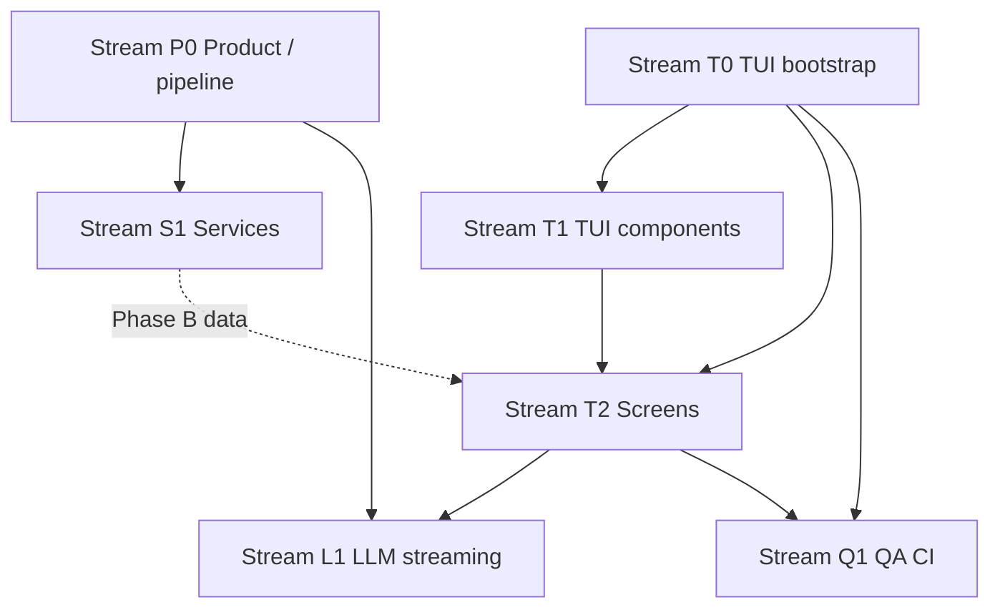

# Agent implementation guide

Use this file to **route work**, avoid duplicate effort, and pick the **smallest set of specs** to read before coding. It complements [`project.md`](./project.md) (product contract) and [`tui-README.md`](./tui-README.md) (TUI index + global rules).

**Normative terms** follow [RFC 2119](https://datatracker.ietf.org/doc/html/rfc2119) where used in linked specs.

---

## 1. Start here (3 steps)

1. Read **[`project.md`](./project.md)** — invariants (accuracy, profile dir, no duplicate pipelines).
2. If your work touches the **default `suited` UI** or `src/tui/**`, read **[`tui-phased-delivery.md`](./tui-phased-delivery.md)** (Phase A vs B vs C) and the **global rules** in [`tui-README.md`](./tui-README.md) (non-TTY, key precedence, forbidden imports).
3. Open **[§2 Workstreams](#2-workstreams)** below, pick **one** stream, then only open the **Primary specs** for that row.

---

## 2. Workstreams

Each row is a **parallelizable lane** when dependencies are satisfied. Prefer **one PR per stream slice** (e.g. one screen, one service module) to keep review small.

| ID | Stream | You are building… | Primary specs | Typical code | Depends on |
|----|--------|-------------------|---------------|--------------|------------|
| **P0** | **Product / pipeline** | Behavior that applies to CLI and any UI: profile schema, generate path, validation | [`project.md`](./project.md), [`README.md`](../README.md) accuracy section | `src/profile/`, `src/generate/`, `src/commands/*` | — |
| **S1** | **Service extraction** | Callable modules from commands; no new UI | [`tui-goals-and-constraints.md`](./tui-goals-and-constraints.md), [`tui-phased-delivery.md`](./tui-phased-delivery.md) (Phase B), [`tui-implementation-order.md`](./tui-implementation-order.md) step 1 | `src/services/` (new/refactors), `src/commands/*` | P0 for contracts |
| **T0** | **TUI bootstrap** | Ink app, store, layout, TTY gate, build | [`tui-stack-and-structure.md`](./tui-stack-and-structure.md), [`tui-build.md`](./tui-build.md), [`tui-terminal.md`](./tui-terminal.md), [`tui-README.md`](./tui-README.md) (non-TTY SSOT) | `src/tui/**`, `src/commands/flow.ts`, `tsconfig` | — |
| **T1** | **Shared TUI components** | Reusable inputs, lists, spinners, diff, scroll | [`tui-architecture.md`](./tui-architecture.md), [`tui-ui-mockups.md`](./tui-ui-mockups.md) | `src/tui/components/**` | T0 |
| **T2** | **Screens** | One screen per assignment; wire to services or documented delegation | [`tui-screens.md`](./tui-screens.md), [`tui-ux.md`](./tui-ux.md), [`tui-state-machines.md`](./tui-state-machines.md) as needed | `src/tui/screens/**` | T0+T1; **S1** for Phase B “real” data (Phase A may delegate per phased-delivery) |
| **L1** | **LLM streaming** | `callWithToolStreaming`, tool events, AbortSignal | [`tui-architecture.md`](./tui-architecture.md), [`tui-testing.md`](./tui-testing.md) | `src/claude/**`, TUI consumers | P0; coordinate with T2 on Refine/Generate |
| **Q1** | **QA / CI** | Tests, forbidden-import gates, footers | [`tui-testing.md`](./tui-testing.md), [`tui-definition-of-done.md`](./tui-definition-of-done.md) | `src/**/*.test.*`, CI scripts | After `src/tui/**` exists |

**Routing hints**

- **Default entry / non-TTY** behavior is specified in [`tui-README.md`](./tui-README.md) and implemented in **`flow.ts`** — do not fork SSOT across files.
- **Phase A** allows subprocess delegation; **Phase B** expects services — see [`tui-phased-delivery.md`](./tui-phased-delivery.md). If you add delegation, **document it** in phased-delivery or PR description per spec.
- **Forbidden:** `src/tui/**` importing `inquirer`, `ora`, or `src/commands/**` — enforce in Q1 ([`tui-testing.md`](./tui-testing.md)).

---

## 3. Dependency graph (high level)

Sequential **order within TUI** when alone on the team: follow [`tui-implementation-order.md`](./tui-implementation-order.md). The graph above shows **what can run in parallel** across people.

---

## 4. Spec map by activity

| Activity | Read |
|----------|------|
| Decide Phase A vs B scope | [`tui-phased-delivery.md`](./tui-phased-delivery.md), [`tui-definition-of-done.md`](./tui-definition-of-done.md) |
| Layout / keyboard / streaming UI | [`tui-architecture.md`](./tui-architecture.md) |
| Per-screen behavior | [`tui-screens.md`](./tui-screens.md) |
| Errors, Esc vs Ctrl+C | [`tui-failure.md`](./tui-failure.md) |
| Open decisions | [`tui-open-questions.md`](./tui-open-questions.md) |
| Size / LOC | [`tui-scope.md`](./tui-scope.md) |

---

## 5. PR / merge discipline

- **One stream (or slice)** per PR when possible; reference **stream ID** (e.g. `T2: JobsScreen`) in the title or body.
- **Update specs** when you change phase reality: the “current repo status” line in [`tui-phased-delivery.md`](./tui-phased-delivery.md), or open questions in [`tui-open-questions.md`](./tui-open-questions.md).
- **Do not** duplicate business logic in the TUI — call **`src/services/`** (or keep delegation visible until services exist).
- Follow [`CONTRIBUTING.md`](../CONTRIBUTING.md) for tests and lint.

---

## 6. Full file index

See [`README.md`](./README.md) in this folder for a grouped list of all spec files.

---

## 7. Implementation progress (living)

**Norm:** One **phase** at a time. Update this section in the same PR as code changes so agents and humans share one queue.

### Phases (see [`tui-implementation-order.md`](./tui-implementation-order.md))

| Phase | Scope | Status |
|-------|--------|--------|
| **1** | **S1 — Service extraction** (`src/services/*`, commands delegate; `computeRefinementDiff`, CLI parity tests) | **Done** (2026-03-19) |
| **2** | **T0 — TUI infrastructure hardening** (`store.tsx`, `store.test.ts`, global `useInput` per architecture, non-TTY tests) | **Done** (2026-03-19) |
| **3** | **T1 — Shared components** (Spinner, SelectList, … per order §3) | **Done** (2026-03-19) |
| **4** | **T2 — Dashboard + Settings** (variants, health, quick actions; API key probe + `.env`) | **Done** (2026-03-19) |
| **5** | **Single full-screen shell + inline Import/Contact** (no subprocess; Generate/Refine/Profile were stubs at phase close — now superseded by phases 7–8) | **Done** (2026-03-19) |
| **6** | **Jobs screen (T2)** — list/add/delete/view JD/prepare/generate nav | **Done** (2026-03-19) |
| **7** | **Generate screen (T2)** — `runTuiGeneratePdf`, JD sources, flair, `pendingJobId` | **Done** (2026-03-19) |
| **8** | **Refine + Profile MVP** — Refine: Q&A, `applyRefinements`, `DiffView`, `saveRefined`; Profile: stack + summary/bullets, persist like CLI `profile-editor` | **Done** (2026-03-19) |
| **9+** | Close gaps vs [`tui-screens.md`](./tui-screens.md) + Phase C | See **[`tui-definition-of-done.md` § What’s left](./tui-definition-of-done.md#whats-left-backlog-toward-phase-c)**; [`tui-implementation-order.md`](./tui-implementation-order.md) §10–15 |

### Phase 1 — completed work

- Added **`src/services/validate.ts`** — `validateProfile()` (+ `refMap` for CLI listing).
- Added **`src/services/improve.ts`** — `computeHealthScore()`; `commands/improve.ts` delegates display logic.
- Added **`src/services/contact.ts`** — `mergeContactMeta()`; `commands/contact.ts` delegates persistence.
- Added **`src/services/refine.ts`** — `computeRefinementDiff`, `applyRefinementsFromTool`, `generateRefinementQuestions`, `applyRefinements` (Q&A apply), `polishProfile`, `applyDirectEdit` (streaming-shaped generators); **`commands/refine.ts`** delegates non-interactive core.
- Unit tests: `src/services/improve.test.ts`, `src/services/refine.test.ts`.

### Coordination rules (avoid clobbering)

1. **While Phase N is open:** prefer edits only in the **files that phase owns** (see table above).  
2. **Do not** run parallel agents on the same command file + the same service file without splitting (e.g. one agent on `commands/refine.ts`, another on `commands/import.ts`). **Phase 1 was S1-only** — no parallel T0/T1 on `App.tsx` / `store.tsx` until Phase 2 starts.  
3. After each phase, merge or rebase before starting the next so `main` reflects the new boundaries (`src/services/**` is shared infrastructure for later T2).

### Phase 2 — completed work

- **`src/tui/store.tsx`** — `AppState` / `appReducer` / `AppStoreProvider` / `useAppState` / `useAppDispatch` (aligned with [`tui-architecture.md`](./tui-architecture.md); `SET_HAS_REFINED` for snapshot sync until full `SET_PROFILE` loads).
- **`src/tui/App.tsx`** — single top-level `useInput`: suppresses global nav when `inTextInput` or `operationInProgress`; `Esc` → `CANCEL_OPERATION` while op locked; footer hints for locked / text-input modes.
- **`src/tui/runTui.tsx`** — wraps the app with `AppStoreProvider`.
- **`src/tui/store.test.ts`** — reducer unit tests.
- **`src/commands/flow.test.ts`** — non-TTY `runFlow` stderr + `exitCode` (canonical behavior per [`tui-README.md`](./tui-README.md)).

### Phase 3 — completed work

- **`src/tui/components/shared/`** — `Spinner`, `SelectList`, `TextInput` (ink-text-input + `SET_IN_TEXT_INPUT`), `MultilineInput` (debounced `onChange` via `createDebouncedString` / `useDebouncedStringCallback`), `ConfirmPrompt`, `StatusBadge`, `ScrollView`, `InlineEditor`, `DiffView` (`formatDiffBlockLines` + `DiffBlock` from `src/services/refine.ts`), `ProgressSteps`; barrel **`index.ts`**.
- **`src/tui/hooks/debounceString.ts`** + tests — shared debounce used by multiline paste path.
- Colocated **`*.test.ts(x)`** — `renderToString` smoke tests + pure diff/debounce tests.

### Phase 4 — completed work

- **`src/tui/dashboardVariant.ts`** (+ test) — maps snapshot + `hasApiKey()` to the five dashboard states.
- **`src/tui/settings/`** — `probeProvider.ts` (Anthropic / OpenRouter key probes), `upsertEnvFile.ts` (+ test) for `.env` merges.
- **`src/tui/screens/DashboardScreen.tsx`** — `StatusBadge` + variant, optional health via `loadActiveProfile` + `computeHealthScore`, `ScrollView` pipeline/activity, `SelectList` quick actions.
- **`src/tui/screens/SettingsScreen.tsx`** — provider list + masked `TextInput`, **`s`** save (probe + write `.env`), shortcuts **`a`/`A`**, **`o`/`O`**, **`e`**, **`l`**.
- **`src/tui/App.tsx`** — on **Dashboard** with **content** focus, **↑↓** move quick-action list (not global screen nav); **1–8** / letter jumps **no-op** when already on that screen (so **Settings** can use **`s`** for save).

**Imports:** local modules **always** use **`.ts` / `.tsx`** on relative paths (not `.js`, not extensionless). `allowImportingTsExtensions` + `rewriteRelativeImportExtensions` make **`pnpm build`** emit resolvable Node ESM. Extensionless relatives + plain **`tsc` → `node dist/`** do not work; **Biome `useImportExtensions`** enforces the rule so you do not have to remember it by hand.

### Phase 5 — completed work

- **`src/services/importProfile.ts`** — `importProfileFromInput()` (detect/scrape/parse/save); **`commands/import.ts`** delegates the core path and keeps CLI logging + `ensureContactDetails`.
- **`src/tui/runTui.tsx`** — single `render` + `waitUntilExit` (removed `exitBag` / `spawnSync` loop).
- **`src/tui/App.tsx`** — root `Box` sized to terminal (`useTerminalSize`); removed Enter-to-CLI and **`cliArgs.ts`**; **Contact** + **Import** inline; **Tab** passes through on Contact content for field cycling; **↑↓** reserved on Contact for fields (with Dashboard). (Generate / Refine / Profile were stubs here; see phases 7–8 for current screens.)
- **`src/tui/hooks/useTerminalSize.ts`** — listens to `stdout` `resize`.
- **`src/tui/components/Layout.tsx`** — main row `flexGrow={1}` for usable height.
- **Removed** — `DelegateScreen.tsx`, `cliArgs.ts`, **`TuiExitBag`**.

### Phase 6 — completed work

- **`src/services/jobRefinement.ts`** — `runJobRefinementPipeline()` (analyze + curate + `saveJobRefinement`); **`commands/prepare.ts`** delegates curation to it (CLI spinners removed for that path; behavior preserved).
- **`src/tui/store.tsx`** — `deferLetterShortcutsFor` + `SET_DEFER_LETTER_SHORTCUTS` so Jobs can own **a / d / g / p** without colliding with global **`p`→profile** / **`g`→generate**.
- **`src/tui/App.tsx`** — Jobs content: defer those letters; **Esc** chain owned by Jobs (not forced to sidebar); **↑↓** screen-cycle suppressed on Jobs like Dashboard.
- **`src/tui/screens/JobsScreen.tsx`** — Full Phase-A jobs flow per [`tui-screens.md`](./tui-screens.md) (minus prepare streaming UI and two-panel layout polish).

### Phase 7 — completed work

- **`src/generate/layoutSqueeze.ts`** — shared `trySqueeze` (CLI `generate.ts` imports it).
- **`src/services/sectionSelection.ts`** (+ test) — `selectAllSections` for non-interactive “include everything”.
- **`src/services/generateResume.ts`** — `runTuiGeneratePdf()` — reuse job refinement when `jobId` set; else analyze + curate + save refinement; polish; job-scoped profile write; trim/fit loop; PDF + `saveGenerationConfig`.
- **`src/tui/screens/GenerateScreen.tsx`** — source picker (paste / saved / full), MultilineInput paste, flair SelectList, consumes `pendingJobId` from Jobs.

### Phase 8 — completed work (MVP)

- **`src/tui/screens/RefineScreen.tsx`** — `loadSource` → optional already-refined menu + md/json sync → Q&A → `applyRefinements` → `DiffView` + **`SelectList`** (accept / edit proposed summary / discard) → `saveRefined` + `profileToMarkdown`; `profileDir` from `App`.
- **`src/tui/screens/ProfileEditorScreen.tsx`** — loads refined (preserve session) or source; sections include summary, experience (positions/bullets), **skills**, **education**, **certifications**, **projects** (list + a/d/`[`/`]` + primary-field edit); **`s`** save, Esc with unsaved overlay (**s** / **d**/**n** / Esc); `App` defers **a**/**d** from global nav; `InlineEditor` + `SelectList`.
- **`src/tui/App.tsx`** — passes `profileDir` into Refine/Profile; footer hints; **↑↓** screen-cycle suppressed on Refine/Profile content like other list screens.

### Phase A (MVP shell) — criteria

Phase A checklist in [`tui-definition-of-done.md`](./tui-definition-of-done.md) is **satisfied in-repo**: non-TTY `flow` tests, dashboard snapshot fixtures + variant mapping, Jobs 79/80 layout tests, Settings key masking test, error recovery on Dashboard / Contact / Profile / Jobs, etc.

### Phase 9+ — incremental (living)

- **`useOperationAbort`** (`src/tui/hooks/useOperationAbort.ts`) + **`isUserAbort`** (`src/tui/isUserAbort.ts`) — Esc ↔ `AbortController` for Refine / Import / Generate.
- **`src/utils/abort.ts`** — `throwIfAborted` used by LinkedIn scraper + `runTuiGeneratePdf` between major steps.
- **`ImportScreen`** — `importProfileFromInput({ signal })`; error **`SelectList`** (Retry / Settings after 3 / Dismiss).
- **`GenerateScreen`** — `runTuiGeneratePdf({ signal })`; generate errors: Retry / Settings / back to flair; preflight errors (e.g. no saved jobs): back to source.
- Refine refactored to **`useOperationAbort`** (replaces inline `operationCancelSeq` effect).

### What’s next (Phase 9+ preview)

- **Single backlog:** [`tui-definition-of-done.md` — What’s left](./tui-definition-of-done.md#whats-left-backlog-toward-phase-c) (infrastructure, Refine, Profile, Generate, Jobs, Dashboard).
