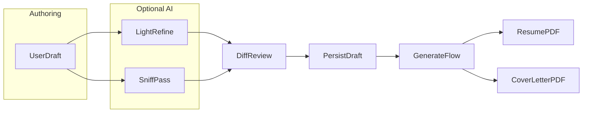

# Cover letter PDF (per job)

**Normative terms** (MUST / MUST NOT / SHOULD / MAY) follow [RFC 2119](https://datatracker.ietf.org/doc/html/rfc2119).

This document defines an **optional** feature: a **user-authored** cover letter per saved job, with **light** LLM assistance, exported to **PDF** alongside the resume PDF workflow. Interactive use is **TUI-first**; CLI **SHOULD** expose equivalent outcomes ([`tui-goals-and-constraints.md`](./tui-goals-and-constraints.md)).

**Related:** [`project.md`](./project.md) (pipeline, profile layout), [`tui-screens.md`](./tui-screens.md) (Jobs, Generate), [`tui-failure.md`](./tui-failure.md) (recovery), [`SECURITY.md`](../SECURITY.md) (API use).

---

## 1. Purpose and scope

- **In scope:** For a **saved job**, the user MAY author a **cover letter** as **Markdown** (subset below), optionally run **two distinct** AI assists (**light refine** and **AI sniff pass**), review changes, and export a **cover letter PDF** (US Letter page size—see terminology).
- **Out of scope for this spec’s v1:** See [§10 Non-goals](#10-non-goals).

---

## 2. Terminology

| Term | Meaning |
|------|---------|
| **Cover letter** | The job application letter document (prose), stored and exported for a specific saved job. |
| **US Letter** | The PDF **page size** (e.g. as used by [`src/pdf/exporter.ts`](../src/pdf/exporter.ts)); not the same as “cover letter.” UI and specs MUST NOT confuse “letter PDF” with paper dimensions alone. |
| **Light refine** | LLM pass focused on **grammar, clarity, concision, tone, and structure** without adding factual claims. |
| **AI sniff pass** | Same **product intent** as the Refine hub’s **AI sniff pass** ([`tui-screens.md`](./tui-screens.md) Refine menu): reduce phrasing that reads as **generic or machine-generated**, aligned with [`sniffReduceAiTellsProfile`](../src/services/refine.ts) philosophy—applied here to **cover letter text only**. |

---

## 3. Accuracy and trust (prose, not reference map)

[`project.md`](./project.md) §6 (**reference map** and ID validation) applies to **resume** assembly and PDF. Cover letters are **continuous prose**; that validation model **does not** apply.

The pipeline **MUST** still enforce:

- **No new facts** — LLM assists **MUST NOT** introduce employers, dates, job titles, skills, metrics, education, or achievements the user did not supply in the draft or existing profile context the user has approved elsewhere.
- **User control** — Any model-suggested change **MUST** be shown in a **review step** (diff or explicit before/after) before replacing persisted draft text; **MUST NOT** silently overwrite the user’s draft.

JD and job metadata (company, title) **MAY** be passed as **context** so the letter stays on-topic; they **MUST NOT** be treated as permission to invent candidate facts.

---

## 4. Authoring model

- **Source of truth:** The **user’s draft** stored per job. Implementation **MUST** use a **single persisted file** per saved job (stable **`jobId`** in app state; on disk under **`jobs/{job-slug}/`** per [`project.md`](./project.md) §7), with **one primary editor** in the TUI so there is no divergent second copy.
- **Canonical on-disk path:** `{profileDir}/jobs/{job-slug}/cover-letter.md`  
  - **Normative helper (implementation):** mirror [`jobRefinedMdPath`](../src/profile/serializer.ts) — e.g. `coverLetterMdPath(profileDir, slug)` returning `join(profileDir, 'jobs', slug, 'cover-letter.md')`.  
  - **Encoding:** UTF-8. **Logical newlines:** LF; the editor **SHOULD** normalize CRLF and lone CR to LF on load (same discipline as the resume markdown editor in [`tui-screens.md`](./tui-screens.md)).
- **Format:** **Markdown** per [§4.1 Markdown subset](#41-markdown-subset-normative). The file **MUST** use the **`.md`** extension in v1.
- **Default:** Missing file or empty file body is treated as **no draft**. When opening the TUI cover letter editor with an empty draft **and** a job description is available, the editor **auto-generates** an initial draft from the user's profile and JD context (streaming; cancellable via Esc). The generated draft is saved immediately. The user **MUST** still review and edit before export.
- **Empty or whitespace-only draft:** After trim, if there is no substantive content, export of the cover letter PDF **MUST NOT** proceed; the UI **SHOULD** disable the export action and/or show a clear error. AI assists that require text **SHOULD** be disabled or no-op with explanation.

### 4.1 Markdown subset (normative)

Content is **Markdown** kept intentionally small for PDF rendering and predictable TUI display:

| Construct | Status |
|-----------|--------|
| Paragraphs (blank line separated) | **Required** support |
| Single newlines within a paragraph (soft break) | **SHOULD** render as line break in PDF where the template allows |
| `**bold**` and `*italic*` (or `_italic_`) | **Required** support |
| `-` / `*` unordered lists | **Required** support |
| Ordered lists (`1.`) | **SHOULD** support |
| `` `inline code` `` | **SHOULD** support; **MUST NOT** be the primary style for cover letters |
| Headings (`#` … `######`) | **MAY** be supported; **SHOULD** use at most **one** heading level in the body if used (avoid resume-like section stacks) |
| Links `[text](url)` | **SHOULD** support for plain text URL output in PDF; **MUST NOT** require clickable PDF links |
| Raw HTML | **MUST** be stripped or escaped at render time (no unescaped HTML in PDF) |
| Block quotes, tables, code fences | **MAY** be omitted in v1 renderers (if omitted, strip or show as plain text) |

Implementations **SHOULD** reuse one shared Markdown → HTML (or AST) path with the resume/profile stack where practical ([`profile/markdown`](../src/profile/markdown.ts) or successor), with a **cover-letter template** that applies letter-appropriate CSS.

### 4.2 History and snapshots

- **v1:** The **only** durable artifact for the draft is **`cover-letter.md`**. Edits from AI assists **replace** the working file **after user confirmation** in the review step (same path).
- **Global** [`refinement-history.md`](./refinement-history.md) / `refined-history/` applies to **`refined.json` / `refined.md`** only. Cover letter saves **MUST NOT** append to **`refined-history/`** or mutate global refined snapshots.
- **Labels:** If logging or a future per-job snapshot feature records a **reason** string, use **`cover-letter-light-refine`** and **`cover-letter-sniff`** (distinct from global **`ai-sniff`** on profiles). This is **not** required for v1 file I/O.
- **Future:** Optional **`jobs/{job-slug}/cover-letter-history/`** (or similar) with capped snapshots **MAY** be specified later; v1 **MUST NOT** require it.

---

## 5. AI assists: light refine vs AI sniff

Both assists are **optional**. They **MUST** use the same **trust pattern**: async operation with **`AbortSignal`**, then **diff / accept / reject** (or equivalent) before save.

| Assist | Goal | MUST NOT |
|--------|------|----------|
| **Light refine** | Improve grammar, clarity, concision, tone, paragraphing | Add facts, employers, metrics, or “padding” |
| **AI sniff pass** | Reduce AI- or template-like phrasing (analogous to profile sniff) | Add facts; perform a full rewrite unless the user explicitly opts into broader edits in a future spec |

**Distinction:** **Light refine** is general editing assistance; **AI sniff** is narrowly scoped to **machine-like** tone. The TUI **SHOULD** offer **both** as separate actions (e.g. on **Jobs** job detail) so users can run sniff without conflating it with general refinement.

**Implementation note:** Services **SHOULD** live under `src/services/` with prompts in `src/claude/prompts/`, modeled on existing sniff/refine streaming patterns ([`RefineScreen`](../src/tui/screens/RefineScreen.tsx) `ai-sniff-run`, [`refine.ts`](../src/services/refine.ts)). **`src/tui/**` MUST NOT** import `src/commands/**`.

---

## 6. Pipeline placement

Conceptually: **Jobs** (saved JD) → user prepares/edits draft → **Generate** may produce **resume PDF** and, when selected, **cover letter PDF**.

- **Prepare** and **Generate** for the resume **SHOULD NOT** hard-require a cover letter draft.
- **Generate** (TUI) **SHOULD** offer a control such as **“Also export cover letter PDF”** when a job context is active and the draft is non-empty (exact placement: flair/section steps vs. pre-export—implementation detail; behavior is normative).

---

## 7. PDF export

- **Rendering:** HTML → PDF via the existing exporter ([`src/pdf/exporter.ts`](../src/pdf/exporter.ts)), **US Letter** size, with a **dedicated template** under [`src/templates/`](../src/templates/) (simple business letter: date, optional addresses if available from contact metadata, salutation, body, closing).
- **Output location:** Same family as resume PDFs: default under **`resumes/`** relative to `process.cwd()` with job-slug subdirectories as in [`project.md`](./project.md) §7; filename **MUST** be distinguishable from the resume PDF (e.g. `*cover-letter*` in the basename).

---

## 8. TUI (normative behavior)

**Primary surfaces:**

- **Jobs → job detail → `l`:** Opens [`CoverLetterEditor`](../src/tui/components/CoverLetterEditor.tsx), a **full-screen** editor replacing the resume editor view. Uses [`FreeCursorMultilineInput`](../src/tui/components/shared/FreeCursorMultilineInput.tsx) with **`wordWrap`** enabled so long lines wrap at word boundaries instead of truncating.
- **Generate:** **Also export cover letter PDF** when job-selected and draft is valid; **MUST** be disabled or blocked when the draft is empty.

**Editor modes:** The cover letter editor opens in **nav mode** (not edit mode) so keybinds are immediately accessible. **Tab** enters text editing; **Esc** from edit mode returns to nav mode. Nav-mode keybinds: **`r`** light refine, **`n`** AI sniff pass, **`s`** save, **Esc** close editor. Both AI assists produce a **DiffView** review step (accept/reject) before persisting changes. If the draft is empty on open and a job description is available, the editor **auto-generates** an initial draft from the user’s profile and JD context.

**Input isolation:** When the cover letter editor is open, parent `ResumeEditor` input handlers (Esc, Tab, job-mode keybinds) **MUST** be deactivated (`!coverLetterOpen` guard on `isActive`) so keys are owned exclusively by the cover letter screen.

**Shell:** TopBar **Job:** context when working in a job-scoped flow ([`tui-document-shell.md`](./tui-document-shell.md)). **Esc** ownership follows [`tui-screens.md`](./tui-screens.md) (Jobs / Generate own back stacks when content-focused).

**Handoff:** **`pendingJobId`** from Jobs → Generate **SHOULD** pre-select the job for generate, consistent with today’s **g** navigation.

**Recovery:** Errors use labels consistent with [`tui-failure.md`](./tui-failure.md) (e.g. Retry, Edit inputs, Back / Dismiss).

---

## 9. CLI parity

[`tui-goals-and-constraints.md`](./tui-goals-and-constraints.md) requires equivalent outcomes in CLI and TUI. All cover-letter behavior **MUST** be implemented on top of **`src/services/`** and invoked from **both** `generate` (CLI) and **Generate** (TUI), not duplicated in `src/tui/**` beyond wiring.

**Normative surface (v1):** extend the existing **`generate`** command ([`src/index.ts`](../src/index.ts)); **MUST NOT** add a separate top-level subcommand for v1 unless a later spec revises this.

| Flag | Meaning |
|------|---------|
| **`--cover-letter`** | When the run is **job-targeted** (same conditions as today for persisting/using a [`SavedJob`](../src/profile/schema.ts) / `jobId` in `generation.json`), **also** export the cover letter PDF **after** the resume PDF succeeds when `jobs/{slug}/cover-letter.md` is non-empty after trim. If the run is **not** job-targeted, the flag **MUST** be rejected or ignored with a clear message. |
| **`--cover-letter-only`** | **Skip** resume build/render/export; **only** export the cover letter PDF from `cover-letter.md`. **MUST** be combined with **`--job-id <id>`** (where `id` is a [`SavedJob.id`](../src/profile/schema.ts)) so the slug and output path resolve deterministically. **MUST** fail with a clear error if the file is missing or empty after trim. |

**Mutual exclusion:** **`--cover-letter-only`** implies **no** resume PDF for that invocation; **`--cover-letter`** alone runs the normal resume pipeline **plus** optional cover letter PDF when the flag is set.

Document flags in [`README.md`](../README.md) and `--help` when implemented.

---

## 10. Non-goals

- Full **mail-merge** of contact fields beyond what a simple template provides.
- Multiple competing **variants** per job (versioning beyond normal file edits).
- **ATS keyword stuffing** automation or JD-only **auto-generation** of the full letter without a user draft (unless a future opt-in **starter** is specified).
- A **global** cover letter not tied to a saved job (v1).

---

## 11. Testing and quality

- Pure helpers and prompt boundaries: **unit tests** in `src/**/*.test.*`.
- TUI: smoke tests where appropriate; **no** forbidden imports (`src/tui/**` → `src/commands/**`) per [`tui-testing.md`](./tui-testing.md).

---

## 12. Resolved decisions (summary)

| Topic | Resolution |
|-------|------------|
| On-disk path | `{profileDir}/jobs/{job-slug}/cover-letter.md` (UTF-8, LF logical newlines) |
| Format | Markdown per §4.1; `.md` only in v1 |
| CLI | `generate --cover-letter` and `generate --cover-letter-only --job-id <id>` per §9 |
| Snapshots | v1: single file; no `refined-history/`; optional reason labels `cover-letter-light-refine` / `cover-letter-sniff` for future logging or snapshots |

## 13. Deferred (future specs)

- Locale-specific **date** formatting in the letterhead.
- **Multiple** named drafts per job.
- Optional LLM **starter paragraph** (explicit opt-in product).

---

## 14. Diagram

JD context **MAY** feed **LR** and **Sniff** but **MUST NOT** authorize new candidate facts. **Abort** applies to AI steps.
