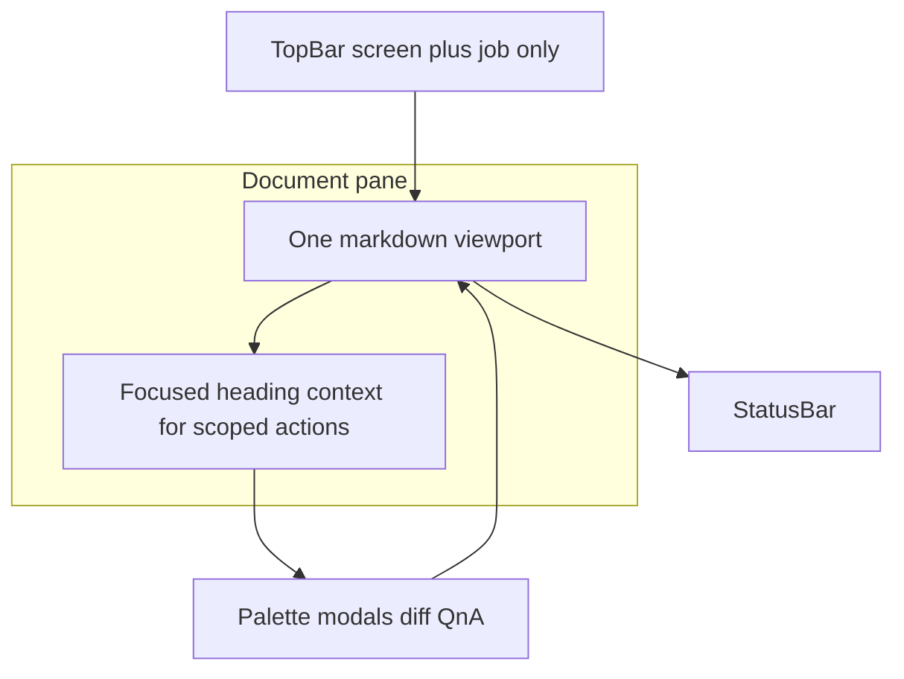

# TUI document shell (normative target)

This document is the **engineering + product contract** for the **content-first** redesign of the default `suited` Ink UI. It **supersedes** the sidebar-first screen model described historically in [`tui-screens.md`](./tui-screens.md) for **target** behavior; during migration, both may be referenced until the strangler removes legacy navigation.

**Source plan:** Cursor plan **TUI content-first redesign** (`tui_content-first_redesign_dbe512cb.plan.md`) — canonical copy may live under the user’s `.cursor/plans/`; this spec is the **in-repo** contract.

**Related:** [`tui-architecture.md`](./tui-architecture.md) (keyboard, blocking UI), [`tui-ux.md`](./tui-ux.md) (principles), [`tui-ui-mockups.md`](./tui-ui-mockups.md) (ASCII), [`project.md`](./project.md) (paths).

---

## 1. Executive summary

- **One resume document:** continuous markdown **viewport** rendered from **in-memory `Profile`** via `profileMarkdownContent` ([`src/profile/markdown.ts`](../src/profile/markdown.ts)). When **`hasRefined`**, the dashboard resume pane is an **editable** markdown buffer: **`parseMarkdownStringToProfile`** round-trips edits before save; the **caret’s current `##` section** selects **polish** scope and **section consultant** handoff (**Ctrl+P** / **Ctrl+E** while focused in the editor). Under **`## Experience`**, the nearest preceding **`<!-- pos-id:… -->`** marker scopes **polish** (`polishProfile` `positionIds`) and **consultant** to that role only. **Ctrl+S** saves to **`persistenceTarget`**; **Ctrl+O** opens the outline (plain **`o`** types a letter while editing). The markdown field uses an **external content revision** so debounced parent state does not overwrite in-flight typing (terminal selection and caret stay stable); the caret does not blink to avoid full-frame redraws clearing selection.
- **Focused section = context** for polish, review, prompt, structured edit — not a split manuscript or tab-per-section default.
- **TopBar:** only **screen name** + **Job:** line (`—` / base vs `Company — Title`).
- **StatusBar:** single row — **left** notifications/ops (glyph + color first), **right** pipeline/health/locks (graphical first); **`:`** for text detail.
- **Palette (`:`)** and **Ctrl-?** help (fallbacks: `?`, `h`, palette **Help**) for global actions.
- **Persistence:** **active document session** with explicit `persistenceTarget` — job saves **only** `jobs/{slug}/refined.*`; base saves **only** global `refined.*`; no silent cross-write.
- **New service:** **section-scoped professional review** (consultant-style pass limited to one section).

RFC 2119 terms apply.

---

## 2. Product principles

| Principle | Requirement |
|-----------|----------------|
| Document first | One scrollable viewport; outline/jump for navigation. |
| Section = context | `ResumeSectionId` + index: anchors, `polishProfile` scope, Enter → scoped menu. |
| Profile canonical | Viewport always from `Profile`; external `.md` via `isMdNewerThanJson` + sync (global and job-scoped paths). |
| Persistence isolation | Typed save dispatch per target; tests forbid wrong-path writes. |
| Minimal chrome | No pipeline/health/keys on TopBar; no banner row under TopBar. |
| Progressive disclosure | Overlays + palette for Import, Settings, Contact, Generate, Refine hub, Jobs, dashboard stats. |
| Graphics + fallbacks | Default: color/glyphs; `NO_COLOR`: mandatory ASCII/text semantics ([`tui-terminal.md`](./tui-terminal.md)). |
| CLI parity | No TUI-only behavior; subcommands remain authoritative for automation. |

---

## 3. Shell layout

---

## 4. Screens and overlays

| Surface | Behavior |
|---------|----------|
| **Resume** | Default: `DocumentShell` — TopBar + optional outline + markdown viewport + StatusBar. With refined data loaded: **editable** markdown editor + section context strip (see executive summary). |
| **Import / Settings / Contact / Generate** | **Full-viewport overlays** (stacked on **Resume** or **Jobs** underlay); TopBar shows **effective** screen; **Esc** pops one overlay (then underlay), except **Generate** / **Jobs** own Esc for wizard/list depth first. **`SET_SCREEN`** clears the overlay stack. |
| **Jobs** | Job target updates TopBar **`Job:`**; list/CRUD/prepare/feedback via **palette** or **Jobs** dialog — no permanent second header row. |
| **Profile editor** | Overlay or nested flow from scoped **Edit**; same save rules as session target. |
| **Refine hub** | Q&A, polish picker, sniff, whole-profile consultant, direct edit, history — **palette** or modal from Resume. **`refineResumeIntent`** in **`store`** (`SET_REFINE_RESUME_INTENT`) is a one-shot handoff (dashboard heading menu, polish/consultant from editor): optional **`positionId`** when **`sectionId === 'experience'`** scopes polish (`positionIds`) and consultant (see §8). **`RefineScreen`** consumes on **`has-refined-menu`** (after any md/json sync prompt is cleared) → **`polish-run`** or **`consultant-section-run`** / **`consultant-view`**, or clears it on **`first-refine-menu`** if refined data does not exist yet. |

**Empty state:** No `source.json` → dominant **Import** CTA; do not show a fake full resume.

**Resume scroll:** **Read-only** wrapped viewport restores **scroll offset** after overlay pop (remount); in-memory **per `profileDir`** only ([`resumeScrollMemory`](../src/tui/resumeScrollMemory.ts)). The **refined markdown editor** uses **logical-line** scroll inside `FreeCursorMultilineInput` (not the same wrapped offset map).

**Generate precedence:** If TopBar has a job, Generate wizard **defaults** to it; **`pendingJobId`** from Jobs handoff still supported — wizard picks **TopBar job first**, then pending, then picker (spec order in implementation).

---

## 5. Wayfinding (P0)

- **Command palette (`:`)** — primary overflow for global actions. When **`overlayStack`** is non-empty, palette includes **Close overlays / back to underlay** → **`CLEAR_OVERLAYS`** (one step back to the underlay; contrast with **Esc** popping one level at a time where not owned by **Generate** / **Jobs**).
- **Outline / jump** — optional column when width allows; palette filter by `ResumeSectionId`; optional substring jump-to-first-match.
- **MUST NOT** rely solely on **Tab** through every section on long resumes.

---

## 6. Data model and files

| Artifact | Role |
|----------|------|
| `refined.json` / `refined.md` | Global refined profile (base session). |
| `refined-history/` | Refinement snapshots — **default: global refined only**; per-job history optional (decision recorded in [`refinement-history.md`](./refinement-history.md)). |
| `refinements/{jobId}.json` | **Curation plan** from **prepare** (analyze/curate), consumed by Generate — **not** the editable job resume body. |
| `jobs/{slug}/refined.json` (+ optional `.md`) | **Editable job-scoped copy** when job target selected; init from global refined + plan without writing global until user saves in base context. |

**Slug drift:** When SavedJob company/title changes, **MUST** document one rule in [`project.md`](./project.md): migrate `jobs/{slug}/` **or** stable directory keyed by `jobId` — implement one approach consistently.

**Data-flow (normative):** prepare → `refinements/{jobId}.json`; user edits → `jobs/{slug}/refined.*`; Generate reads plan + active profile + job refined when applicable.

---

## 7. Active document session

Central abstraction (e.g. `src/tui/activeDocumentSession.ts` + `store` fields):

- **`persistenceTarget`:** `'global-refined' | { jobId: string; slug: string }`
- **Jobs screen** sets `SET_PERSISTENCE_TARGET` to the open job (detail, JD/prep/feedback flows, delete confirm) using `SavedJob.id` and `makeJobSlug(company, title)`; **list / add wizard / err / feedback-done** use global; **Resume (`dashboard`)** navigation clears job target in the reducer so Generate handoffs keep job context until then.
- **In-memory `Profile`**, **dirty**, **load/save** dispatch
- **All** AI apply paths (`polishProfile`, `applyDirectEdit`, consultant apply, Q&A apply) mutate session profile and **save only** through dispatch for the active target.

**Refine (`RefineScreen` + `persistenceTarget`):** Loads editable profile via `loadRefinedTuiState` — job file `jobs/{slug}/refined.json` when present, else the same fallback as `loadActiveProfile` (global refined body or `source.json`). **Q&A session** (`RefinedData.session`) is read from **global** `refined.json` when it exists; job JSON has no session field, so in-memory session stays aligned with global for keep-session flows while **profile body** saves go to the job file through `saveRefinedForPersistenceTarget`.

**Contact (`mergeContactMeta`):** MUST route profile persistence by `persistenceTarget` (optional third-argument options; TUI passes store target). Job context writes **`jobs/{slug}/refined.json`** via `saveJobRefinedProfile` only; MUST NOT write global `refined.json` as a side channel. Global `contact.json` still updates as today.

---

## 8. Section model

1. **`ResumeSectionId`** (document shell MVP) — Stable string ids for top-level resume blocks emitted as `##` headings from `profileMarkdownContent`: **`summary`**, **`experience`**, **`skills`**, optional **`education`**. Pure index: [`src/tui/resumeSectionIndex.ts`](../src/tui/resumeSectionIndex.ts) (`buildResumeSectionIndex`, `findDisplayRowForSection`, `buildSectionScrollRowMap`, `resumeSectionIdAtMarkdownOffset`, `resumeExperiencePositionIdAtMarkdownOffset`, `experiencePositionShortLabel`). Labels align with Refine polish / section consultant strings ([`refineSectionMenu.ts`](../src/tui/refineSectionMenu.ts)).
2. **Experience role scope** — Each position block in emitted markdown is preceded by **`<!-- pos-id:{Position.id} -->`**. While the caret is under **`## Experience`**, the **nearest preceding** `pos-id` line determines the **active role**. That id is passed to **`polishProfile`** as **`positionIds`** (dashboard **Ctrl+P** and Refine when intent carries it) and to the section consultant as optional **`positionId`** on **`refineResumeIntent`**, resolved to a scoped prompt via **`buildExperiencePositionConsultantLabel`** ([`src/generate/consultant.ts`](../src/generate/consultant.ts)). If the caret is in Experience but **above** the first `pos-id`, polish/consultant apply to **all** experience; the dashboard strip shows **`Experience (pick a role block)`**.
3. **Resume (Dashboard) — read-only vs editor** — When **`hasRefined` is false**, the pane is a **wrapped read-only** `TextViewport` + `ScrollView` (same outline / **Enter** on heading behavior as before). When **`hasRefined`** and refined state has loaded, the pane is **`FreeCursorMultilineInput`** ([`src/tui/components/shared/FreeCursorMultilineInput.tsx`](../src/tui/components/shared/FreeCursorMultilineInput.tsx)): logical-line editing, **Backspace** and the usual **Delete** key (DEL / `0x7f`, including Kitty CSI-u **127**) erase **before** the caret — Ink maps that byte to `key.delete`; we correct via raw stdin + [`stdinBackspaceAsDelete127.ts`](../src/tui/stdinBackspaceAsDelete127.ts). True **forward delete** (`ESC [ 3 ~`, Fn+Delete on many Mac terminals) still erases **after** the caret. **Esc** clears resume body focus (`resumeBodyFocused`) so **`inTextInput`** is false and global **1–n**, **:** palette, and letter jumps work; **Tab** refocuses the editor. Refocus also resets when **`persistenceTarget`** or **`profileDir`** changes. **Ctrl+S** parse + save via **`parseMarkdownStringToProfile`** + **`saveRefinedForPersistenceTarget`**, **Ctrl+P** / **Ctrl+E** (API required for polish) scoped by §8.1–8.2, **Ctrl+O** outline jump (plain **`o`** inserts while `inTextInput`). Inline **polish diff** uses **`DiffView`** + accept/discard. Parent passes **`externalContentRevision`** (increment only on load / save normalize / polish accept / reset) so debounced `onChange` → `mdDraft` does **not** overwrite the buffer; caret is **not** blinked (reduces full redraws that clear terminal selection).
4. **Outline / heading menus (both modes)** — **`o`** opens outline; **Ctrl+O** when editing. **`Enter`** on a **read-only** wrapped row that is a matching `##` heading opens **Section actions**. **`refineResumeIntent`** may include optional **`positionId`** for **`experience`** ([`store`](../src/tui/store.tsx)); [`RefineScreen`](../src/tui/screens/RefineScreen.tsx) consumes it on **`has-refined-menu`**: **`runPolish`** forwards **`positionIds`**; **`runConsultantSectionReview`** uses the scoped experience label when **`experiencePositionId`** is set. Polish retry keeps **`lastPolishPositionIdsRef`**.

**Terminology (glossary):** Global palette **“Refinement…”** hub vs per-section **Polish**, **Review**, **Edit**, **Prompt** — do not overload “Refine” for both.

**Future** — Section highlight in viewport, **Prompt** from heading menu, richer glossary parity.

---

## 9. Services

| Item | Contract |
|------|----------|
| `sectionScopedProfessionalReview(profile, sectionScope, signal)` | New; scoped consultant-style evaluation + apply via existing refinements tool boundary; unit-test scope instruction builder. |
| `applyDirectEdit` | Preamble naming section; forbid edits outside scope in prompt. |
| `saveJobRefinedProfile` | Already in [`serializer`](../src/profile/serializer.ts); use from session dispatch for job target. |
| `saveRefinedForPersistenceTarget` | [`src/tui/saveRefinedForPersistenceTarget.ts`](../src/tui/saveRefinedForPersistenceTarget.ts) — pure router: global → `saveRefined`; job → `saveJobRefinedProfile` only (no session write). Unit-tested (mocked serializer). |
| `loadRefinedTuiState` | [`src/tui/refinedPersistenceContext.ts`](../src/tui/refinedPersistenceContext.ts) — Refine load path: profile per target + session from global refined when present (see §7). |

---

## 10. Keyboard and precedence

Order (align [`tui-README.md`](./tui-README.md) when updated):

1. **Blocking UI** (`blockingUiDepth`, `pendingNav`, etc.)
2. **Command palette open** — captures keys until closed (ahead of global nav)
3. **`inTextInput`**
4. **`operationInProgress`** — Esc → cancel where wired
5. **Ctrl-?** / fallback help — when not in raw multiline capture
6. **Global** — `q`, palette trigger `:`, etc.

**Sidebar number keys (`1–n`)** — **removed** in target shell; navigation = palette + overlays + `Resume` default. During migration, document if temporarily retained.

---

## 11. Visual language

- StatusBar / TopBar / section focus: **color + glyphs** by default.
- **`NO_COLOR`:** every cue has text/ASCII equivalent — matrix in [`tui-terminal.md`](./tui-terminal.md).
- Diff overlay is **review layer**; document remains primary; restore scroll anchor on return.

---

## 12. Failure and edge cases

- **Save vs disk:** Optional mtime check at save vs load baseline → confirm reload / overwrite ([`tui-failure.md`](./tui-failure.md)).
- **md/json:** Never silent clobber; sync confirm flows per context.
- **Offline / no API key:** Non-LLM editing and navigation MUST remain usable; LLM actions show clear blocked state.
- **Section-scoped professional review (TUI wiring):** **Shipped** — Refine hub **Section consultant** plus **Resume** (read-only heading menu and **refined editor** **Ctrl+E**) with optional **single-role experience** scope via **`positionId`** / scoped evaluation label. **`evaluateProfileSection`** (`src/services/refine.ts` re-export) then the same **consultant-view** apply / follow-up / **diff** / keep-session path as whole-profile consultant review.

---

## 13. Testing

- Active session save paths (job vs base); no cross-write (`saveRefinedForPersistenceTarget`, `loadRefinedTuiState`, contact persistence tests).
- Section index pure functions (`resumeSectionIndex.test.ts`, including experience `pos-id` resolution); scoped-review instruction builder (`buildExperiencePositionConsultantLabel` in `consultant.section.test.ts`); cursor row width helper (`freeCursorLayout.test.ts`); DEL-as-backspace stdin sniff (`stdinBackspaceAsDelete127.test.ts`).
- Resume scroll memory across overlay remount (`resumeScrollMemory.test.ts`).
- `NO_COLOR` smoke for StatusBar **pipeline strip** (`formatPipelineStrip(..., { noColor })`, `shouldUseNoColor()`; `pipelineStrip.test.ts`, `noColorEnv.test.ts`).
- `pnpm check:tui-imports`; `pnpm vibecheck` before merge.

---

## 14. Non-goals

Mouse-primary UX; arbitrary live markdown buffer as source of truth; multiplayer editing.
