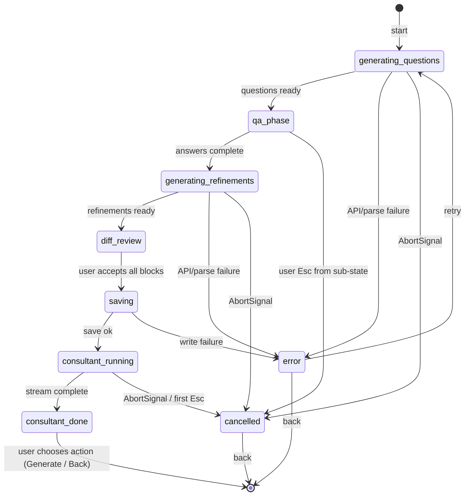
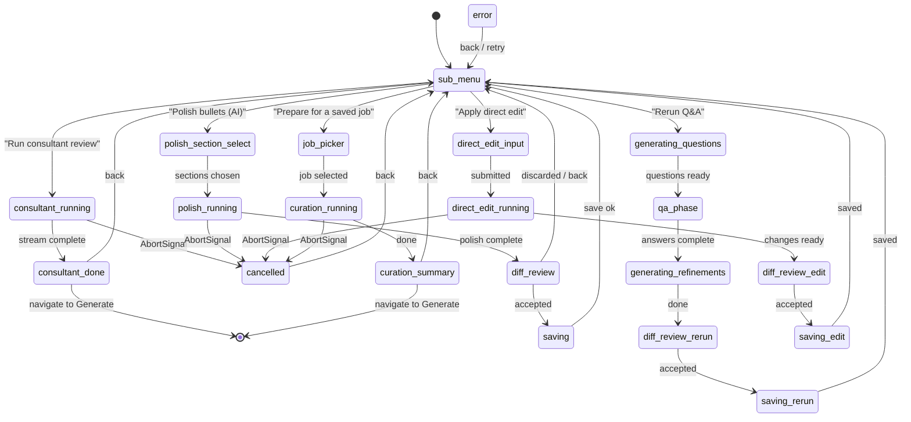
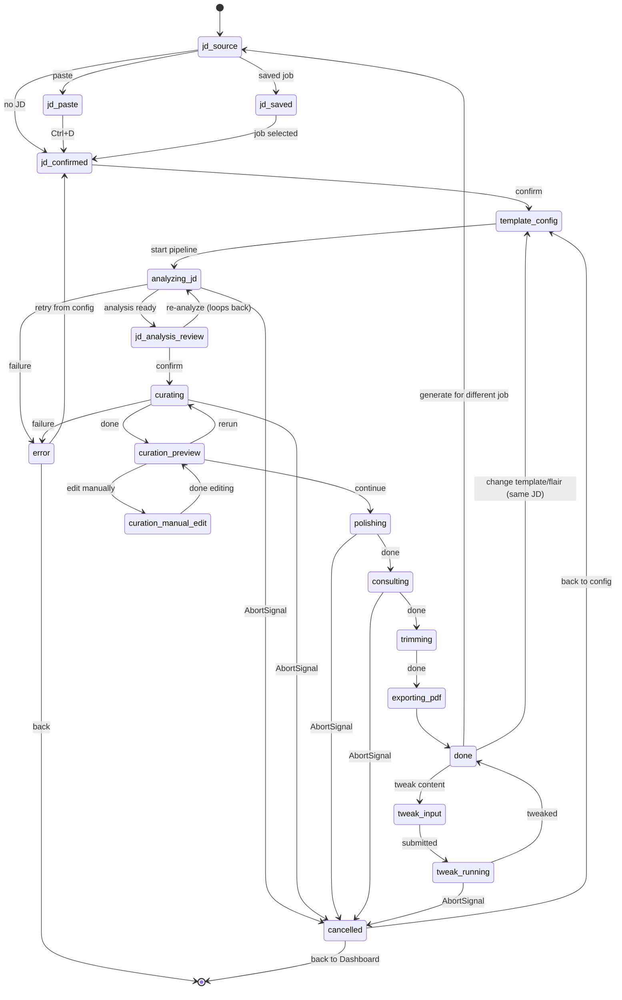

# State machines (Mermaid)

High-level diagrams for the two largest flows. **Screen details** in [screens.md](./tui-screens.md) are authoritative for edge cases.

> **Notation:** `cancelled` is distinct from `error`. `cancelled` = user aborted via Esc/AbortSignal; show "Cancelled" + Retry / Back. `error` = unexpected failure; show error message + Retry / Edit / Back.

---

## RefineScreen (not refined — happy path + error/cancel)

---

## RefineScreen (already refined — sub-menu)

**Note on polish pre-selection:** `polish_section_select` is a `CheckboxList` that lets the user pick which sections (Experience, Skills, etc.) and optionally which positions to polish. This must happen **before** calling `polishProfile()`. The existing CLI does this interactively; the TUI replaces those prompts with a CheckboxList + optional position SelectList before starting the API call.

---

## GenerateScreen (pipeline)

**`tweak_input` / `tweak_running`:** These map to `tweakResumeContent()` in the existing CLI (post-generation natural-language edits). The `MultilineInput` collects the instruction; the result replaces the current `ResumeDocument` and re-runs only trimming + PDF export.

*(Step names match [screens.md](./tui-screens.md#generatescreen).)*
