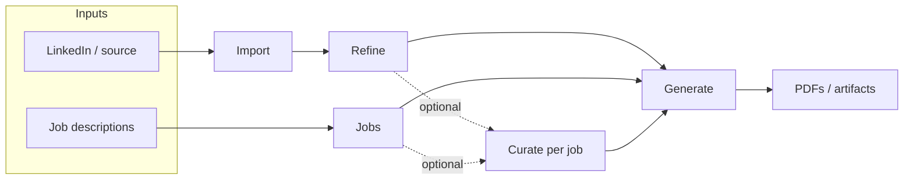

# UX & workflow

The CLI mental model is **Import → Refine → (optional per-job Curate) → Generate**. The TUI exposes **`SCREEN_ORDER.length` sidebar destinations** plus **manual section editing** opened from **Refine** or *(planned)* **Curate**, with **Dashboard** for suggested next step.

**Curate (planned):** A future **main sidebar** row for **job-targeted** iteration on refined content — job list → per-job hub (polish, consultant, edit sections, direct edit, clear & restart from global refined + plan). See [CurateScreen](./tui-screens.md#curatescreen-planned).

- **Pipeline status** — Derived from profile data (source, `refined.json`, jobs, last PDF). Compact indicators in the **Header** on every screen (when implemented).
- **Suggested next step** — Dashboard highlights one primary action from state; secondary actions via sidebar.
- **First-run / blocked** — No API key → banner + path to Settings. No source → suggest Import. Avoid dead-end dashboards.

**Discoverability:** `1–n` screen jumps (`n` = sidebar row count) + letter shortcuts for sidebar targets (exact map lives with `SCREEN_ORDER` in `App.tsx`). Today: **`d i c j r g s`**. **`p` is not a global jump** (reserved for **Jobs** → prepare when that screen defers shortcuts). **Planned Curate row:** add **`u` → Curate** (see [`tui-open-questions.md`](./tui-open-questions.md)). **Manual profile sections:** Refine → *Edit profile sections* (global refined); *(planned)* Curate → *Edit profile sections* (job-scoped store). **Command palette** (`:` / `/`) is specified in architecture but **not implemented** yet; when added, it **MUST** take key precedence while open.

**Contextual footer:** The bottom hint line reflects the **focused panel**’s current screen and step (lists, scroll panes, confirms, etc.). Inline “nav” dim lines under menus were removed so shortcuts are not duplicated in the body.

**Curate** (dotted edges) is **optional**: users may go **Refine → Generate** or **Jobs → Generate** without it. When used, **Curate** is the hub for **per-job curated** profile iteration before or between generates.

Users may jump to any screen anytime; Dashboard ties intent back to the pipeline.

**Generate — template vs flair:** **Template** picks the **baseline layout**; **flair** (level) is a **separate** control on how much **creative freedom** the layout/design agent may use when rendering that baseline (more flair → more **variety** and **artistic license** in the visual result). Defaults in Settings apply only to the initial flair level, not to template choice.

---

## Selection caret (visual focus)

The UI **MUST** present **at most one** bright list caret (`›`) at a time: the row that **currently** receives list arrow keys. When focus is on the **main panel**, the **sidebar** is treated as background — **fully dimmed, no caret**. When focus is on the **sidebar**, panel lists are **inactive**: **no caret**, all rows dim (e.g. `SelectList` with `isActive={false}`). The Dashboard main panel has **no** in-panel action list (navigation is the sidebar). **Split panes** (e.g. Jobs job list beside detail): only the pane that owns **↑↓** shows the caret; the other pane stays dim without `›`. **Contact** browse mode shows the caret on the field label only with panel focus; in **edit** mode the caret is suppressed so the text field cursor is the sole insertion indicator.

Normative detail and tables: [Architecture — Selection caret & inactive menus](./tui-architecture.md#selection-caret--inactive-menus).

---

## Holistic design principles

This section records a **joint UX / engineering review** of the shell: what “good” looks like for users, and what the codebase should guarantee so behavior stays consistent as screens grow.

### Wayfinding

- **Screen + profile context:** The user **SHOULD** always see **which screen** they are on, **which profile directory** is active (or an honest “no profile” state), and **whether refined output exists** — without opening Dashboard. Today the **header** carries name / counts / coarse status; **pipeline dots** in mockups ([`tui-ui-mockups.md`](./tui-ui-mockups.md)) are the **target** for full parity on every screen (not only Dashboard body copy).
- **Breadcrumbs inside deep editors:** Profile section stacks stay **inside** the editor panel ([resolved](./tui-open-questions.md#resolved)); the shell header does not duplicate them.
- **Suggested next step:** Dashboard remains the **primary** place for narrative “what to do next”; other screens **SHOULD** use short titles + footers, not duplicate long coaching text, unless the user is blocked (no API key, no source).

**Implementation alignment:** **`Header`** (or equivalent) **SHOULD** consume the **same snapshot signals** as `getDashboardVariant` / pipeline badges so the strip does not drift from Dashboard logic. Adding a new pipeline milestone **MUST** update header + dashboard rules together (single source of derived state where feasible).

### Trust and predictability

- **No surprise exits:** While any **blocking** confirm or error menu is visible, **q** and **screen jumps** **MUST NOT** fire ([Architecture — Blocking UI](./tui-architecture.md#blocking-ui-and-global-input)). This matches user expectation from CLI modals and avoids data loss on muscle memory.
- **Cancel vs quit:** **Esc** backs out or cancels work **in-process**; **Ctrl+C** exits the app ([`tui-failure.md`](./tui-failure.md)). Footers **SHOULD** repeat that distinction wherever streaming or long jobs run.
- **Settings honesty:** After saving `.env`, remind that **keys apply on next launch** (already normative on Settings); **SHOULD** show a **one-line success state** so users know persistence succeeded before restart.

### Discoverability (shortcuts without memorization)

- **Footer as coach:** The bottom line is the **primary** teaching surface for **this panel’s** keys. **SHOULD** follow a stable pattern: action keys first, then navigation, then quit ([`tui-architecture.md` — Footer composition](./tui-architecture.md#footer-composition-two-line-model)).
- **Letter and number jumps:** The global map (**`d i c j r g s`**, **`1–n`**) is powerful but opaque. **SHOULD** add an in-app **shortcut help** overlay (**`?`**) listing jumps, **q**, **Tab**, and “sidebar vs content focus” — toggled from `App.tsx`, suppressed while `inTextInput` or `operationInProgress` unless the overlay owns input.
- **Command palette (`:` / `/`):** Remains the **north star** for power users; when implemented, it **MUST** register a **palette-open** guard ahead of global navigation ([resolved](./tui-open-questions.md#resolved)). Until then, **`?`** help is the lightweight substitute.

### Progressive disclosure

- **One primary action per blocked state:** e.g. no API key → one clear path to Settings; no source → one path to Import. Secondary actions via sidebar only.
- **Wizard depth:** Add-job, Refine sub-flows, and Generate steps **SHOULD** show **where they are in the flow** (title + optional step index) so users can predict how many **Esc** presses return to the list.

### Cross-screen vocabulary

- **Recovery actions:** Prefer the same **labels** and **keys** across screens where behavior matches: **Retry**, **Check Settings** (after repeated failures), **Back** / **Dismiss**, **Edit inputs** ([`tui-failure.md`](./tui-failure.md)). Reduces re-learning when moving between Import, Generate, Jobs, and Refine.

### Narrow terminals and `NO_COLOR`

- **Layout:** Split panes and side-by-side diffs **MUST** degrade gracefully (stacked layout, unified diff) per existing mockup notes.
- **Meaning:** Do not rely on **color alone** for success vs error; use **prefix characters** (`!`, `✓` where encoding allows) or **dim vs bright** text. Aligns with side-by-side diff polish in [`tui-definition-of-done.md`](./tui-definition-of-done.md).
