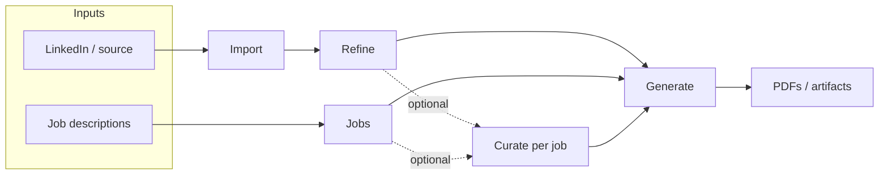

# UX & workflow

**Target shell:** **[`tui-document-shell.md`](./tui-document-shell.md)** — one **Resume** markdown viewport, **TopBar** (screen + **Job:**), **StatusBar** (glyphs + pipeline), **`:`** palette, **Ctrl-?** help. **Job-targeted** editing uses the **same** UX as base refined; only **persistence** changes (`jobs/{slug}/refined.*`). Planned **Curate** as a separate sidebar row is **superseded** by **job selection on the document** (see document shell §4–6).

The CLI mental model remains **Import → Refine → (optional per-job iteration) → Generate**. The **shipped** TUI used a **sidebar** (`SCREEN_ORDER`, Dashboard, etc.); migration moves actions into **palette + overlays** while preserving services.

- **Pipeline status** — **Target:** compact **graphical** segments on **StatusBar right** (and optional **Dashboard** palette dialog). **Not** on TopBar. Legacy: Header pipeline strip until removed.
- **Suggested next step** — **Target:** palette **Dashboard** / health / validate; empty state on Resume when no source.
- **First-run / blocked** — No API key → StatusBar / modal path to Settings; no source → Import CTA. Non-LLM actions MUST work without a key.

**Discoverability (target):** **`:`** palette + **Ctrl-?** (fallbacks `?`, `h`, Help item) + outline/jump; **MUST NOT** rely only on Tab through every section. Legacy **`1–n`** sidebar jumps **removed** when migration completes. **Manual profile sections:** scoped **Edit** from section context; save respects **active session** target.

**Contextual chrome (target):** **Single-line StatusBar** — left = alerts/ops, right = pipeline/health; **no** two-line footer cheat sheet. Deep overlay footers MAY add one line for that flow only.

**Per-job iteration** (dotted edges) is **optional**: users may go **Refine → Generate** or **Jobs → Generate** without editing a job copy. When used, **job target + same document UX** replaces the old **Curate** sidebar concept.

Users may open palette / overlays anytime; **Resume** is the default home for the manuscript.

**Generate — template vs flair:** **Template** picks the **baseline layout**; **flair** (level) is a **separate** control on how much **creative freedom** the layout/design agent may use when rendering that baseline (more flair → more **variety** and **artistic license** in the visual result). Defaults in Settings apply only to the initial flair level, not to template choice.

---

## Selection caret (visual focus)

The UI **MUST** present **at most one** bright list caret (`›`) at a time: the row that **currently** receives list arrow keys. When focus is on the **main panel**, the **sidebar** is treated as background — **fully dimmed, no caret**. When focus is on the **sidebar**, panel lists are **inactive**: **no caret**, all rows dim (e.g. `SelectList` with `isActive={false}`). The Dashboard main panel has **no** in-panel action list (navigation is the sidebar). **Split panes** (e.g. Jobs job list beside detail): only the pane that owns **↑↓** shows the caret; the other pane stays dim without `›`. **Contact** browse mode shows the caret on the field label only with panel focus; in **edit** mode the caret is suppressed so the text field cursor is the sole insertion indicator.

Normative detail and tables: [Architecture — Selection caret & inactive menus](./tui-architecture.md#selection-caret--inactive-menus).

---

## Holistic design principles

This section records a **joint UX / engineering review** of the shell: what “good” looks like for users, and what the codebase should guarantee so behavior stays consistent as screens grow.

### Wayfinding

- **Screen + job context:** **TopBar** shows **screen** + **Job:** line only. **StatusBar right** carries pipeline/health glyphs. Profile directory **MAY** appear in palette “About / status” or Settings — not required on TopBar.
- **Breadcrumbs inside deep editors:** Unchanged — stay inside overlay ([resolved](./tui-open-questions.md#resolved)).
- **Suggested next step:** **Palette** Dashboard entry + empty states; avoid duplicating long coaching on StatusBar.

**Implementation alignment:** StatusBar / palette **SHOULD** consume the **same derived signals** as `getDashboardVariant` / snapshot loaders so pipeline dots do not drift.

### Trust and predictability

- **No surprise exits:** While any **blocking** confirm or error menu is visible, **q** and **screen jumps** **MUST NOT** fire ([Architecture — Blocking UI](./tui-architecture.md#blocking-ui-and-global-input)). This matches user expectation from CLI modals and avoids data loss on muscle memory.
- **Cancel vs quit:** **Esc** backs out or cancels work **in-process**; **Ctrl+C** exits the app ([`tui-failure.md`](./tui-failure.md)). Footers **SHOULD** repeat that distinction wherever streaming or long jobs run.
- **Settings honesty:** After saving `.env`, remind that **keys apply on next launch** (already normative on Settings); **SHOULD** show a **one-line success state** so users know persistence succeeded before restart.

### Discoverability (shortcuts without memorization)

- **Footer as coach:** The bottom line is the **primary** teaching surface for **this panel’s** keys. **SHOULD** follow a stable pattern: action keys first, then navigation, then quit ([`tui-architecture.md` — Footer composition](./tui-architecture.md#footer-composition-two-line-model)).
- **Letter and number jumps:** The global map (**`d i c j r g s`**, **`1–n`**) is powerful but opaque. **SHOULD** add an in-app **shortcut help** overlay (**`?`**) listing jumps, **q**, **Tab**, and “sidebar vs content focus” — toggled from `App.tsx`, suppressed while `inTextInput` or `operationInProgress` unless the overlay owns input.
- **Command palette (`:` / `/`):** Remains the **north star** for power users; when implemented, it **MUST** register a **palette-open** guard ahead of global navigation ([resolved](./tui-open-questions.md#resolved)). Until then, **`?`** help is the lightweight substitute.

### Progressive disclosure

- **One primary action per blocked state:** e.g. no API key → one clear path to Settings; no source → one path to Import. Secondary actions via sidebar only.
- **Wizard depth:** Add-job, Refine sub-flows, and Generate steps **SHOULD** show **where they are in the flow** (title + optional step index) so users can predict how many **Esc** presses return to the list.

### Cross-screen vocabulary

- **Recovery actions:** Prefer the same **labels** and **keys** across screens where behavior matches: **Retry**, **Check Settings** (after repeated failures), **Back** / **Dismiss**, **Edit inputs** ([`tui-failure.md`](./tui-failure.md)). Reduces re-learning when moving between Import, Generate, Jobs, and Refine.

### Narrow terminals and `NO_COLOR`

- **Layout:** Split panes and side-by-side diffs **MUST** degrade gracefully (stacked layout, unified diff) per existing mockup notes.
- **Meaning:** Do not rely on **color alone** for success vs error; use **prefix characters** (`!`, `✓` where encoding allows) or **dim vs bright** text. Aligns with side-by-side diff polish in [`tui-definition-of-done.md`](./tui-definition-of-done.md).
