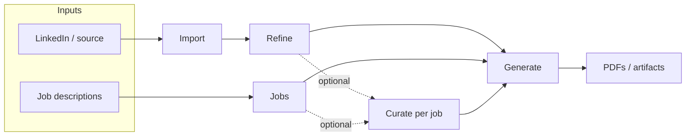

# UX & workflow

The CLI mental model is **Import → Refine → (optional per-job Curate) → Generate**. The TUI exposes **`SCREEN_ORDER.length` sidebar destinations** plus **manual section editing** opened from **Refine** or *(planned)* **Curate**, with **Dashboard** for suggested next step.

**Curate (planned):** A future **main sidebar** row for **job-targeted** iteration on refined content — job list → per-job hub (polish, consultant, edit sections, direct edit, clear & restart from global refined + plan). See [CurateScreen](./tui-screens.md#curatescreen-planned).

- **Pipeline status** — Derived from profile data (source, `refined.json`, jobs, last PDF). Compact indicators in the **Header** on every screen (when implemented).
- **Suggested next step** — Dashboard highlights one primary action from state; secondary actions via sidebar.
- **First-run / blocked** — No API key → banner + path to Settings. No source → suggest Import. Avoid dead-end dashboards.

**Discoverability:** `1–n` screen jumps (`n` = sidebar row count) + letter shortcuts for sidebar targets (exact map lives with `SCREEN_ORDER` in `App.tsx`). Today: **`d i c j r g s`**. **`p` is not a global jump** (reserved for **Jobs** → prepare when that screen defers shortcuts). **Planned Curate row:** add **`u` → Curate** (see [`tui-open-questions.md`](./tui-open-questions.md)). **Manual profile sections:** Refine → *Edit profile sections* (global refined); *(planned)* Curate → *Edit profile sections* (job-scoped store). **Command palette** (`:` / `/`) is specified in architecture but **not implemented** yet; when added, it **MUST** take key precedence while open.

**Contextual footer:** The bottom hint line reflects the **focused panel**’s current screen and step (lists, scroll panes, confirms, etc.). Inline “nav” dim lines under menus were removed so shortcuts are not duplicated in the body.

**Curate** (dotted edges) is **optional**: users may go **Refine → Generate** or **Jobs → Generate** without it. When used, **Curate** is the hub for **per-job curated** profile iteration before or between generates.

Users may jump to any screen anytime; Dashboard ties intent back to the pipeline.

**Generate — template vs flair:** **Template** picks the **baseline layout**; **flair** (level) is a **separate** control on how much **creative freedom** the layout/design agent may use when rendering that baseline (more flair → more **variety** and **artistic license** in the visual result). Defaults in Settings apply only to the initial flair level, not to template choice.

---

## Selection caret (visual focus)

The UI **MUST** present **at most one** bright list caret (`›`) at a time: the row that **currently** receives list arrow keys. When focus is on the **main panel**, the **sidebar** is treated as background — **fully dimmed, no caret**. When focus is on the **sidebar**, panel lists are **inactive**: **no caret**, all rows dim (e.g. `SelectList` with `isActive={false}`). The Dashboard main panel has **no** in-panel action list (navigation is the sidebar). **Split panes** (e.g. Jobs job list beside detail): only the pane that owns **↑↓** shows the caret; the other pane stays dim without `›`. **Contact** browse mode shows the caret on the field label only with panel focus; in **edit** mode the caret is suppressed so the text field cursor is the sole insertion indicator.

Normative detail and tables: [Architecture — Selection caret & inactive menus](./tui-architecture.md#selection-caret--inactive-menus).
