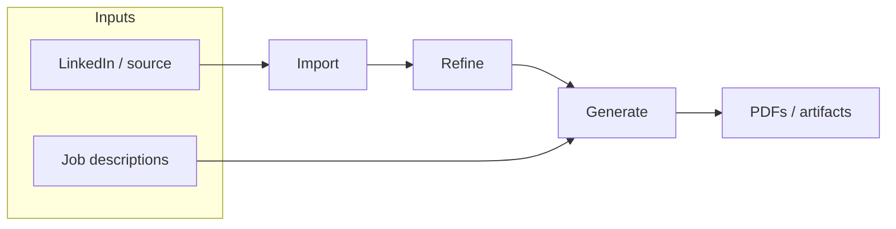

# UX & workflow

The CLI mental model is **Import → Refine → Generate**. The TUI exposes **eight peer screens** with **Dashboard** for suggested next step.

- **Pipeline status** — Derived from profile data (source, `refined.json`, jobs, last PDF). Compact indicators in the **Header** on every screen (when implemented).
- **Suggested next step** — Dashboard highlights one primary action from state; secondary actions via sidebar.
- **First-run / blocked** — No API key → banner + path to Settings. No source → suggest Import. Avoid dead-end dashboards.

**Discoverability:** `1–8` screen jumps + letter shortcuts (`g` `j` `i` `d` `r` `p` `c` `s`). Finalize conflicts with text fields at implementation. Optional command palette (`:` or `/`).

Users may jump to any screen anytime; Dashboard ties intent back to the pipeline.
