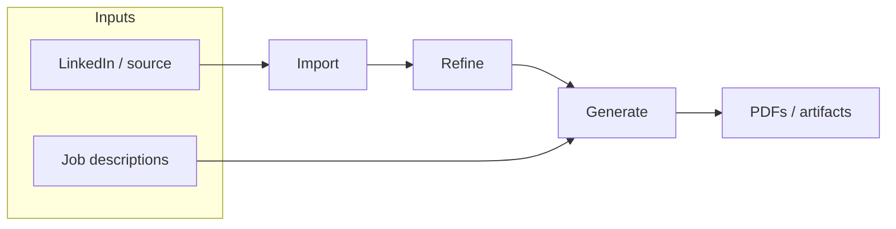

# UX & workflow

The CLI mental model is **Import → Refine → Generate**. The TUI exposes **seven sidebar destinations** plus **manual section editing** under **Refine**, with **Dashboard** for suggested next step.

- **Pipeline status** — Derived from profile data (source, `refined.json`, jobs, last PDF). Compact indicators in the **Header** on every screen (when implemented).
- **Suggested next step** — Dashboard highlights one primary action from state; secondary actions via sidebar.
- **First-run / blocked** — No API key → banner + path to Settings. No source → suggest Import. Avoid dead-end dashboards.

**Discoverability:** `1–7` screen jumps + letter shortcuts (`g` `j` `i` `d` `r` `c` `s`) for sidebar targets. **`p` is not a global jump** (reserved for **Jobs** → prepare when that screen defers shortcuts). **Manual profile sections:** Refine menu → *Edit profile sections*. Optional command palette (`:` or `/`).

**Contextual footer:** The bottom hint line reflects the **focused panel**’s current screen and step (lists, scroll panes, confirms, etc.). Inline “nav” dim lines under menus were removed so shortcuts are not duplicated in the body.

Users may jump to any screen anytime; Dashboard ties intent back to the pipeline.

---

## Selection caret (visual focus)

The UI **MUST** present **at most one** bright list caret (`›`) at a time: the row that **currently** receives list arrow keys. When focus is on the **main panel**, the **sidebar** is treated as background — **fully dimmed, no caret**. When focus is on the **sidebar**, panel lists are **inactive**: **no caret**, all rows dim (e.g. `SelectList` with `isActive={false}`). The Dashboard main panel has **no** in-panel action list (navigation is the sidebar). **Split panes** (e.g. Jobs job list beside detail): only the pane that owns **↑↓** shows the caret; the other pane stays dim without `›`. **Contact** browse mode shows the caret on the field label only with panel focus; in **edit** mode the caret is suppressed so the text field cursor is the sole insertion indicator.

Normative detail and tables: [Architecture — Selection caret & inactive menus](./tui-architecture.md#selection-caret--inactive-menus).
