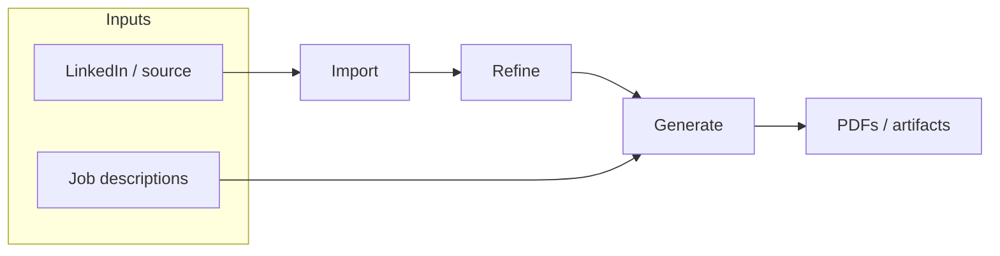

# TUI specification

**What this is:** the product + engineering contract for a **full-screen Ink TUI** that replaces **`runDashboard`** (`src/commands/dashboard.ts`, inquirer) when users run `suited` with no subcommand in a real TTY. **Domain logic** in `generate/`, `profile/`, `claude/`, and `ingestion/` stays unchanged; only how we **drive** it and **surface** results changes. See [`docs/ARCHITECTURE.md`](../docs/ARCHITECTURE.md).

**What this is not:** a second implementation of resume logic, a web UI, or a reason to fork the CLI—`suited import`, `suited refine`, etc. remain the non-interactive source of truth.

---

## Contents

| Section | What you get |
|--------|----------------|
| [Goals & non-goals](#goals--non-goals) | North star, explicit out-of-scope |
| [UX & workflow](#ux--workflow) | Pipeline mental model, discoverability |
| [Stack (Ink v5)](#stack-ink-v5) | Library choice |
| [Directory structure](#directory-structure) | File tree |
| [Modified files](#modified-files-only-2) | Touch surface outside `src/tui/` |
| [Architecture](#key-architecture-decisions) | State, keyboard, streaming, async |
| [Focus & navigation model](#focus--navigation-model) | Sidebar vs content vs multi-pane |
| [Component hierarchy](#component-hierarchy) | React tree |
| [UI mockups](#ui-mockups-target-appearance) | ASCII wireframes |
| [Terminal & environment](#terminal--environment) | TTY, size, paste |
| [Failure & recovery](#failure-recovery-and-resume) | Errors, retry, honesty |
| [Testing](#testing) | What to automate |
| [Screen details](#screen-details) | Per-screen behavior |
| [Build](#build-changes) | deps, tsconfig |
| [Implementation order](#implementation-order) | Phased rollout |
| [Definition of done](#definition-of-done-mvp) | Ship checklist |
| [Open questions](#open-questions) | Decisions to lock at build time |
| [Scope estimate](#scope-estimate) | File / line ballpark |

---

## Goals & non-goals

**Goals**

- **Keyboard-first** — Every flow completable without a mouse; keys behave predictably per mode (navigation vs text vs async).
- **Pipeline legible** — User always sees where they are in Import → Refine → Generate, not eight disconnected panels.
- **Honest state** — No fake “resume” or optimistic badges; reflect real files and CLI outcomes.
- **CLI parity** — Anything doable in the TUI should remain doable via subcommands for scripts and CI.
- **Boring reliability** — Non-TTY never hangs; wide/narrow terminals degrade layout, not semantics.

**Non-goals (v1)**

- Replacing or wrapping **every** flag/edge case of every subcommand inside the TUI.
- Mouse support, true color as a requirement, or pixel-perfect layout across all terminals.
- Persisting TUI-specific session state beyond what the existing app already writes to disk.
- Internationalizing copy (English-first; structure should allow i18n later if needed).

---

## Stack (Ink v5)

React-based terminal rendering (Ink v5): TypeScript-first ESM, fits the repo; components map to eight screens; hooks suit async, streaming, and stepped flows; diff review is componentized instead of manual cursor math.

**Invariant:** the TUI is a **pure UI shell** over existing modules. Prefer calling into the same functions the CLI uses rather than re-serializing business rules in `src/tui/`.

---

## UX & workflow

The CLI’s mental model is **Import → Refine → Generate**. The TUI exposes **eight peer screens** for power users; balance that with **pipeline clarity** so it does not feel like a flat launcher.

- **Pipeline status** — Derive from loaded profile data (e.g. source present, `refined.json` exists, at least one job / last PDF). Show compact indicators in **Header** (and optionally **Dashboard**) so users always know where they are in the flow.
- **Suggested next step** — **Dashboard** highlights one primary action (e.g. “Import source,” “Run refine,” “Generate for a job”) from state, not only static quick-action cards. Secondary actions remain available via sidebar.
- **First-run / blocked states** — If there is no API key (or no usable provider config), show a **blocking banner** on Dashboard with a single path to **Settings** (or env instructions). If there is no imported source, the suggested next step is **Import**; avoid dead-end empty dashboards.

**Discoverability:** `1–8` jumps are fast but not mnemonic. Also support **single-letter shortcuts** where they do not conflict (e.g. `g` → Generate, `j` → Jobs, `i` → Import, `d` → Dashboard, `r` → Refine, `p` → Profile, `c` → Contact, `s` → Settings — finalize in implementation to avoid clashes with text fields). Optionally add a **command palette** (`:` or `/`) that fuzzy-finds screens and actions for users who forget shortcuts.

**Visual reference:** Target layouts and key states are sketched in **[UI mockups](#ui-mockups-target-appearance)** (ASCII, ~80 columns) later in this doc — not pixel-perfect screenshots, but a shared picture for implementation and review.

**End-to-end pipeline (conceptual):** the product story stays linear even though the UI offers parallel entry points.



Users may **jump** to any screen via sidebar or shortcuts; **Dashboard** ties intent back to the pipeline (suggested next step + badges).

---

## Directory Structure

```
src/tui/
  index.tsx                   ← Ink app root
  App.tsx                     ← Screen router, global keybindings
  store.ts                    ← Context + useReducer global state
  hooks/
    useProfile.ts             ← Load/watch profile files
    useAsyncOp.ts             ← Generic async op with status/error
    useKeymap.ts              ← Navigation bindings
    useStreaming.ts           ← Accumulate streaming Claude output
  components/
    layout/
      Header.tsx              ← Profile status bar (top)
      Footer.tsx              ← Key hints (context-sensitive)
      Sidebar.tsx             ← Nav menu panel
      ContentArea.tsx         ← Right-side content region
      Layout.tsx              ← Composes all layout pieces
    shared/
      Spinner.tsx
      DiffView.tsx            ← +/- diff blocks (color optional) + accept/edit/keep
      ProgressSteps.tsx       ← Step 1/4 → 2/4 visual indicator
      TextInput.tsx
      MultilineInput.tsx      ← JD paste area
      SelectList.tsx          ← Replaces inquirer list
      CheckboxList.tsx        ← Replaces inquirer checkbox
      StatusBadge.tsx
      ScrollView.tsx
  screens/
    DashboardScreen.tsx
    ImportScreen.tsx
    RefineScreen.tsx          ← Most complex: Q&A + diff review state machine
    GenerateScreen.tsx
    JobsScreen.tsx
    ProfileEditorScreen.tsx
    ContactScreen.tsx
    SettingsScreen.tsx
```

~31 new files, ~5,000–7,000 lines total.

---

## Modified files (only 2)

| File | Change |
|---|---|
| `src/index.ts` | Add `runTui()` when no subcommand + interactive TTY (stdin **and** stdout); else existing CLI behavior |
| `src/claude/client.ts` | Add `callWithToolStreaming()` export alongside existing `callWithTool` |

All `src/commands/` files remain unchanged — `suited import`, `suited refine`, etc. still work.

---

## Key Architecture Decisions

**Global state** (`store.ts`): `useReducer` + Context — tracks active screen, loaded profile, focus target (sidebar vs content), and `operationInProgress` flag that suppresses **sidebar / screen-jump** navigation during async ops (content may still scroll). Start simple; if cross-screen shared state grows, extracting a small external store is an implementation detail — **do not** rewrite screens for it up front.

```typescript
interface AppState {
  profileDir: string;
  profile: Profile | null;
  hasRefined: boolean;
  activeScreen: Screen;
  focusTarget: 'sidebar' | 'content';
  operationInProgress: boolean;
}

type Action =
  | { type: 'SET_SCREEN'; screen: Screen }
  | { type: 'SET_PROFILE'; profile: Profile; hasRefined: boolean }
  | { type: 'SET_FOCUS'; target: 'sidebar' | 'content' }
  | { type: 'SET_OPERATION_IN_PROGRESS'; value: boolean };
```

**Keyboard model:**

| Key | Behavior |
|---|---|
| `Tab` | Toggle focus sidebar ↔ content |
| `↑↓` | Move selection in focused panel |
| `Enter` | Confirm / activate |
| `Esc` | Back / cancel **modal**; during long-running ops, **cancel** if the op supports `AbortSignal` (see below) |
| `1–8` | Direct screen jump (when not typing; suppressed like `q` during text input) |
| Letter shortcuts | Jump to screen when not in text input (see UX section); must not steal keys from `<TextInput>` / `<MultilineInput>` |
| `:` or `/` | Optional: open command palette (screen search) |
| `q` | Quit (suppressed during input) |
| `Ctrl+C` | Hard exit (always works) |

**Footer (context-sensitive):** The **example** line in the component hierarchy is not global copy. Define rules per mode so the UI stays predictable:

| Mode | Footer emphasis |
|---|---|
| Default navigation | Navigate, Enter, Tab, screen jumps, Quit |
| Text / multiline input | Enter = submit or newline (per widget), Esc = blur/cancel, **no** accidental `q` quit |
| Async (scrape, save, non-streaming API) | Spinner + **Esc = cancel** when `AbortSignal` is wired; otherwise Esc = back only + message that cancel is not available |
| Streaming (LLM text) | Reading stream + optional cancel; clarify whether Ctrl+C kills process or only stream |
| Diff / bullet review | Per-block actions; Esc = exit step or go back to previous sub-state |

**Streaming output:** Add `callWithToolStreaming()` to `claude/client.ts` using `client.messages.stream()`. The `useStreaming` hook accumulates text deltas for live display in `<ScrollView>`.

Real flows interleave **text**, **tool use**, and **completion**. The generator should yield structured events (not only raw text) so the UI can show a stable line (e.g. “Calling tool…”) instead of flashing partial JSON:

```typescript
export async function* callWithToolStreaming<T>(
  systemPrompt: string,
  userMessage: string,
  tool: Tool,
  model = 'claude-sonnet-4-6',
): AsyncGenerator<
  | { type: 'text'; text: string }
  | { type: 'tool_start'; name: string }
  | { type: 'tool_end'; name: string }
  | { type: 'done'; result: T }
>
```

Document **cancellation**: pass `AbortSignal` from the TUI into stream/read calls where the SDK allows; map **Esc** to abort when safe, **Ctrl+C** always exits the process.

**Long-running ops:** `useAsyncOp` hook wraps any `Promise` — tracks `idle/running/done/error`. During `running`, global `operationInProgress` blocks **sidebar and screen-jump** navigation; offer **Esc** to cancel when the underlying op accepts `AbortSignal` so users are not trapped during long scrapes.

```typescript
function useAsyncOp<T>() {
  // state: { status: 'idle' | 'running' | 'done' | 'error', result: T | null, error: string | null }
  // returns: { ...state, run: (fn: () => Promise<T>) => void }
}
```

**Screen index (`1`–`8`):** stable ordering for muscle memory and docs.

| Key | Screen | Role |
|-----|--------|------|
| `1` | Dashboard | Pipeline, suggested next, quick actions |
| `2` | Import | Source ingestion |
| `3` | Refine | Q&A, diffs, bullet review |
| `4` | Generate | JD → tailored PDF flow |
| `5` | Jobs | Saved jobs, JD store, status |
| `6` | Profile | Structured profile editor |
| `7` | Contact | Contact fields |
| `8` | Settings | API key, paths, defaults |

Letter shortcuts (`g`, `j`, `i`, …) should mirror this map where possible; **finalize** against conflicts with text inputs and the command palette.

---

## Focus & navigation model

`focusTarget: 'sidebar' | 'content'` in `AppState` is the **minimum** model. Some screens need **finer focus** inside `content`:

| Screen | Focus regions (Tab order suggestion) |
|--------|--------------------------------------|
| Default (most screens) | Sidebar ↔ main content (forms, lists) |
| **Jobs** | Sidebar ↔ job list ↔ detail panel (three stops; narrow layout may collapse to two) |
| **Profile** | Breadcrumb/stack: section list ↔ editor ↔ nested position/bullets (implement as a **small local stack** or explicit sub-focus; Esc pops one level) |
| **Refine / Generate** | During sub-states (Q&A, diff, JD paste), Tab may move between **prompt**, **input**, and **primary actions**; global `1`–`8` still suppressed when typing |

**Rules**

- **Tab** advances focus along the active screen’s ordered regions; **Shift+Tab** optional but nice if Ink/key handler allows.
- **Esc** pops one level (blur input → cancel modal → exit sub-state) before quitting the app.
- When `operationInProgress` is true, **do not** change screen via sidebar or `1`–`8`; still allow scroll in content and **Esc** where cancel is implemented.

---

## Component Hierarchy

```
<App>                          ← global state, keyboard router
  <Layout>
    <Header />                 ← "Suited  ·  Jane Smith  ·  12 positions  ·  refined"
    <Box flexDirection="row">
      <Sidebar                 ← navigation items, highlights active
        items={NAV_ITEMS}
        activeScreen={screen}
        onSelect={setScreen}
      />
      <ContentArea>            ← flex:1, scrollable
        {screen === 'dashboard'     && <DashboardScreen />}
        {screen === 'import'        && <ImportScreen />}
        {screen === 'refine'        && <RefineScreen />}
        {screen === 'generate'      && <GenerateScreen />}
        {screen === 'jobs'          && <JobsScreen />}
        {screen === 'profile'       && <ProfileEditorScreen />}
        {screen === 'contact'       && <ContactScreen />}
        {screen === 'settings'      && <SettingsScreen />}
      </ContentArea>
    </Box>
    <Footer />                 ← context-sensitive; see Keyboard / Footer table
  </Layout>
</App>
```

---

## UI mockups (target appearance)

These are **ASCII wireframes** for implementers and reviewers. Real Ink output may use spacing, bold/dim, and optional color; semantics should match. Target width **80 columns**; narrow layouts are called out per screen.

### Shell layout (most screens)

```
┌──────────────────────────────────────────────────────────────────────────────┐
│ Suited  ·  Jane Smith  ·  12 positions  ·  refined ✓                        │
├───────────────┬──────────────────────────────────────────────────────────────┤
│ ► 1 Dashboard │  Suggested next: Run refine on your profile                  │
│   2 Import    │  ─────────────────────────────────────────────────────────── │
│   3 Refine    │  Pipeline                                                    │
│   4 Generate  │    Source      [●]  Refined    [●]  Jobs      [●]  Last PDF  │
│   5 Jobs      │                                                              │
│   6 Profile   │  Quick actions                                               │
│   7 Contact   │    [ Refine ]   [ Import ]   [ Generate… ]   [ Jobs ]        │
│   8 Settings  │                                                              │
│               │  Recent                                                      │
│               │    Mar 18  generated  acme-senior-engineer.pdf               │
│               │    Mar 17  refined   refined.json updated                    │
├───────────────┴──────────────────────────────────────────────────────────────┤
│ Tab focus  ·  ↑↓ select  ·  Enter open  ·  1–8 screen  ·  q quit            │
└──────────────────────────────────────────────────────────────────────────────┘
```

`►` marks the active sidebar row; pipeline dots are compact **status badges** (filled = satisfied, empty = missing).

### Dashboard — blocked API / first-run

When there is no usable provider config, a **banner** sits above the main dashboard body and points users to Settings:

```
┌──────────────────────────────────────────────────────────────────────────────┐
│ Suited  ·  (no profile loaded)                                               │
├───────────────┬──────────────────────────────────────────────────────────────┤
│ ► 1 Dashboard │  ! API key or provider not configured.                       │
│   2 Import    │    Open Settings (8) or set ANTHROPIC_API_KEY in your env.   │
│   …           │  ─────────────────────────────────────────────────────────── │
│               │  Suggested next: Configure API access                        │
│               │    [ Open Settings ]                                         │
├───────────────┴──────────────────────────────────────────────────────────────┤
│ Enter: activate  ·  8: Settings  ·  q quit                                   │
└──────────────────────────────────────────────────────────────────────────────┘
```

### Import — scraping in progress

Long-running scrape: global **screen jump** disabled; footer advertises **Esc** when cancel is wired:

```
┌──────────────────────────────────────────────────────────────────────────────┐
│ Suited  ·  Jane Smith  ·  importing…                                        │
├───────────────┬──────────────────────────────────────────────────────────────┤
│   1 Dashboard │  Import LinkedIn profile                                     │
│ ► 2 Import    │  ─────────────────────────────────────────────────────────── │
│   3 Refine    │  Profile URL                                                │
│   …           │  [ https://linkedin.com/in/……………………………………… ]                 │
│               │  [ ] Headed browser (2FA)                                    │
│               │                                                              │
│               │  ● Detecting ──○ Scraping ──○ Parsing ──○ Done               │
│               │                                                              │
│               │  ⠋ Scraping page…                                            │
├───────────────┴──────────────────────────────────────────────────────────────┤
│ Esc: cancel scrape (when supported)  ·  navigation locked until done       │
└──────────────────────────────────────────────────────────────────────────────┘
```

### Refine — Q&A phase (one question at a time)

```
┌──────────────────────────────────────────────────────────────────────────────┐
│ Suited  ·  Jane Smith  ·  refining…                                          │
├───────────────┬──────────────────────────────────────────────────────────────┤
│   2 Import    │  Refine profile                                              │
│ ► 3 Refine    │  Question 3 of 12                                            │
│   4 Generate  │  ─────────────────────────────────────────────────────────── │
│   …           │  Did you lead the migration from monolith to services?       │
│               │                                                              │
│               │  Your answer                                                 │
│               │  [ Yes, I owned the roadmap and cutover for payments…______ ] │
│               │                                                              │
│               │  Enter: submit answer  ·  Esc: back / blur                   │
├───────────────┴──────────────────────────────────────────────────────────────┤
│ Input mode: q does NOT quit  ·  Esc: cancel blur                             │
└──────────────────────────────────────────────────────────────────────────────┘
```

### Refine — diff review (`DiffView`)

**Prefix symbols** (`-` / `+`) carry meaning even without color; optional red/green is additive:

```
┌──────────────────────────────────────────────────────────────────────────────┐
│ Suited  ·  Jane Smith  ·  review changes                                     │
├───────────────┬──────────────────────────────────────────────────────────────┤
│ ► 3 Refine    │  Review proposed edits                          Block 2 / 8  │
│   …           │  ─────────────────────────────────────────────────────────── │
│               │  - Led a team of 5 engineers                                   │
│               │  + Led a team of 8 engineers across platform and data          │
│               │                                                              │
│               │  ► Accept as-is                                              │
│               │    Edit before apply                                         │
│               │    Discard block                                             │
│               │                                                              │
│               │  ↑↓ choose  ·  Enter confirm  ·  Esc exit step               │
├───────────────┴──────────────────────────────────────────────────────────────┤
│ Diff review: per-block actions  ·  Esc: previous sub-state                   │
└──────────────────────────────────────────────────────────────────────────────┘
```

### Generate — progress steps + JD

```
┌──────────────────────────────────────────────────────────────────────────────┐
│ Suited  ·  Jane Smith  ·  generate                                           │
├───────────────┬──────────────────────────────────────────────────────────────┤
│   3 Refine    │  Generate tailored resume                                    │
│ ► 4 Generate  │  Step 2/4  Curating sections…                               │
│   5 Jobs      │  ● JD ──● Analyze ──○ Curate ──○ Polish ──○ Consult ──○ PDF  │
│   …           │  ─────────────────────────────────────────────────────────── │
│               │  Job: Senior Platform Engineer @ Arize (saved)               │
│               │  Template: [ Modern ▼ ]   Flair: [ ████░ ] 1–5               │
│               │                                                              │
│               │  ⠋ Calling model…                                             │
├───────────────┴──────────────────────────────────────────────────────────────┤
│ Esc: cancel if supported  ·  stream: see footer on implementation            │
└──────────────────────────────────────────────────────────────────────────────┘
```

### Generate — paste job description (`MultilineInput`)

Before analysis, the JD entry step should show a **short hint** (how to finish) and optionally **character count** / soft length warning:

```
┌──────────────────────────────────────────────────────────────────────────────┐
│ Suited  ·  Jane Smith  ·  generate                                           │
├───────────────┬──────────────────────────────────────────────────────────────┤
│ ► 4 Generate  │  Paste job description                                       │
│   …           │  ─────────────────────────────────────────────────────────── │
│               │  ┌──────────────────────────────────────────────────────────┐ │
│               │  │ About the role                                           │ │
│               │  │ We are hiring a Staff Engineer to own …                  │ │
│               │  │ …                                                        │ │
│               │  └──────────────────────────────────────────────────────────┘ │
│               │  1,240 chars  ·  F10 or Ctrl+D: Done (submit)  ·  Esc: back  │
├───────────────┴──────────────────────────────────────────────────────────────┤
│ Multiline: Enter = newline  ·  q does NOT quit                                │
└──────────────────────────────────────────────────────────────────────────────┘
```

*(Exact “done” key is an implementation detail; the footer must state it clearly.)*

### Jobs — two-panel (≥80 cols)

**Narrow terminals:** stack job list **above** the detail panel (same content, different flex direction).

```
┌──────────────────────────────────────────────────────────────────────────────┐
│ Suited  ·  Jane Smith  ·  4 jobs                                            │
├───────────────┬──────────────────────────────────────────────────────────────┤
│   4 Generate  │  Saved jobs                         │  Arize · Sr Platform    │
│ ► 5 Jobs      │  ───────────────────────────────    │  ───────────────────── │
│   6 Profile   │  ► arize-sr-platform      [pdf ✓]   │  Posted 2025-03-10     │
│   …           │    acme-staff-eng         [draft]   │                        │
│               │    old-co-contractor      [pdf ✓]   │  JD preview (scroll)   │
│               │    …                                 │  We are looking for…   │
│               │  a: Add  d: Delete  v: View JD      │                        │
├───────────────┴──────────────────────────────────────────────────────────────┤
│ Tab: sidebar ↔ job list ↔ detail  ·  ↑↓  ·  Enter  ·  q quit                 │
└──────────────────────────────────────────────────────────────────────────────┘
```

### Profile editor — nested sections

```
┌──────────────────────────────────────────────────────────────────────────────┐
│ Suited  ·  Jane Smith  ·  profile                                            │
├───────────────┬──────────────────────────────────────────────────────────────┤
│   5 Jobs      │  Profile  ► Experience                                       │
│ ► 6 Profile   │  ─────────────────────────────────────────────────────────── │
│   7 Contact   │  Sections                                                    │
│   …           │    Summary                                                     │
│               │  ► Experience                                                │
│               │    Skills                                                      │
│               │    Education                                                   │
│               │                                                              │
│               │  Position: Acme — Staff Engineer (2021–present)              │
│               │  [ Edit bullets… ]                                             │
├───────────────┴──────────────────────────────────────────────────────────────┤
│ Enter: drill in  ·  Esc: up one level  ·  Tab: focus                          │
└──────────────────────────────────────────────────────────────────────────────┘
```

### Contact — labeled fields (explicit save)

```
┌──────────────────────────────────────────────────────────────────────────────┐
│ Suited  ·  Jane Smith  ·  contact                                            │
├───────────────┬──────────────────────────────────────────────────────────────┤
│   6 Profile   │  Contact info                                                │
│ ► 7 Contact   │  ─────────────────────────────────────────────────────────── │
│   8 Settings  │  Email      [ jane@example.com___________________________ ]   │
│               │  Phone      [ +1 …_____________________________________ ]   │
│               │  Location   [ San Francisco, CA__________________________ ]   │
│               │  … (additional fields)                                       │
│               │                                                              │
│               │  [ Save all ]     last saved: Mar 18 09:41                    │
├───────────────┴──────────────────────────────────────────────────────────────┤
│ Enter: save field / advance  ·  do not rely on blur alone                    │
└──────────────────────────────────────────────────────────────────────────────┘
```

### Settings — API key masked

```
┌──────────────────────────────────────────────────────────────────────────────┐
│ Suited  ·  settings                                                          │
├───────────────┬──────────────────────────────────────────────────────────────┤
│   7 Contact   │  Settings                                                    │
│ ► 8 Settings  │  ─────────────────────────────────────────────────────────── │
│               │  API key      [ sk-ant-api…•••••••••••••••••••••••••••••• ]   │
│               │  Output dir   [ ./output_________________________________ ]   │
│               │  Default flair [ 3 ▼ ]                                       │
│               │  [ ] Headed browser default                                  │
│               │                                                              │
│               │  [ Save to .env ]                                            │
├───────────────┴──────────────────────────────────────────────────────────────┤
│ Values written to .env  ·  Esc: back                                         │
└──────────────────────────────────────────────────────────────────────────────┘
```

### Optional command palette (`:` or `/`)

```
┌──────────────────────────────────────────────────────────────────────────────┐
│ … (dimmed layout behind) …                                                   │
│ ┌────────────────────────────────────────────────────────────────────────────┐
│ │ : gen                                                                      │
│ │ ────────────────────────────────────────────────────────────────────────── │
│ │ ► Generate resume (screen 4)                                               │
│ │   Go to Jobs                                                               │
│ └────────────────────────────────────────────────────────────────────────────┘
└──────────────────────────────────────────────────────────────────────────────┘
```

### Operation failed + retry (generic)

When an async step fails, show **what** broke (stderr tail or mapped message), not a blank screen. Offer **Retry** (same inputs) and **Back** (return to editable form).

```
┌──────────────────────────────────────────────────────────────────────────────┐
│ Suited  ·  Jane Smith  ·  import                                             │
├───────────────┬──────────────────────────────────────────────────────────────┤
│ ► 2 Import    │  Import failed                                               │
│   …           │  ─────────────────────────────────────────────────────────── │
│               │  Timeout waiting for LinkedIn (network).                     │
│               │  Details: net::ERR_TIMED_OUT …                               │
│               │                                                              │
│               │  ► Retry                                                    │
│               │    Edit URL                                                 │
│               │    Back to Dashboard                                        │
├───────────────┴──────────────────────────────────────────────────────────────┤
│ Enter: choose  ·  Esc: dismiss to previous step when safe                    │
└──────────────────────────────────────────────────────────────────────────────┘
```

---

## Terminal & environment

- **TTY gate:** `runTui()` only when stdin is a TTY **and** stdout is a TTY (and no conflicting flags). If not interactive, **fall through** to existing subcommand / help behavior — never hang waiting for keys. Print a one-line hint when `suited` is run with no args in CI: e.g. `suited --help` or `suited refine`.
- **Size:** Target **≥80×24** for the full sidebar + content layout. Below **80 columns**, switch **Jobs** and similar two-panel screens to **stacked** layout (list above detail, or detail below with scroll). Below **24 rows**, prefer shorter Header/Footer or single-line hints.
- **Resize:** On `SIGWINCH` (or Ink resize events), **re-layout**; do not require restart. Prefer truncating header metadata with ellipsis over overlapping panes.
- **Color & symbols:** Respect `NO_COLOR` / dumb terminals: diff and badges remain readable via **`+` / `-`**, dim/bold, and brackets—not color alone.
- **Paste:** `<MultilineInput>` (JD, etc.) should show a **short hint** (e.g. how to finish: dedicated “Done” action or key). Optionally show **character count** or a soft length warning before starting expensive API steps.
- **Logging:** User-facing errors go in the TUI; avoid spewing stack traces on stdout. If debug is needed, gate behind `DEBUG=` or a Settings toggle and prefer stderr.

---

## Failure, recovery, and resume

- **Idempotent commands:** Prefer re-running CLI-backed operations (refine/generate) over inventing new persistence; surface **clear error lines** and **Retry** on Refine/Generate/Import when the underlying command fails mid-flight.
- **Partial outputs:** If the app writes intermediate files today, the TUI should **reflect** them on reload; if not, do not fake “resume” — show failure and suggest re-run from last good step.
- **Streaming/tool errors:** Distinguish **user-cancelled**, **API error**, and **parse error** in the UI copy so users know whether to retry, fix keys, or edit input.
- **Ctrl+C vs Esc:** **Ctrl+C** exits the process (documented, expected for CLI tools). **Esc** should abort **in-app** work when wired to `AbortSignal`; do not imply Esc kills the OS process unless that is explicitly chosen (it should not be).

---

## Testing

Same runner as the rest of the repo: **Vitest** (`pnpm test`), `environment: 'node'`. TUI code adds **TSX** and optional **ink-testing-library** for render + input simulation.

### Tooling & config

| Piece | Action |
|--------|--------|
| Vitest include glob | Extend [`vitest.config.ts`](../vitest.config.ts) from `src/**/*.test.ts` to also match **`src/**/*.test.tsx`** once TSX tests exist. |
| Dev deps | `pnpm add -D ink-testing-library` (or maintained fork if the ecosystem shifts) **when** the first Ink integration test lands; keep versions aligned with **Ink** major. |
| React/Ink in tests | Use the same **React** version as production; avoid a second React copy (dedupe / `pnpm` overrides if Vitest resolves duplicates). |

**Do not** add a second test runner unless there is a hard blocker—one `pnpm test` in CI should cover `src/tui/**`.

### Where tests live

Colocate with the code under test (matches existing `src/**/*.test.ts` style):

```
src/tui/
  store.test.ts              ← reducer + action contracts
  hooks/
    useKeymap.test.ts        ← pure key routing / “would N fire?”
    useAsyncOp.test.ts       ← state transitions if hook is testable without Ink
  components/
    shared/
      SelectList.test.tsx    ← list + selection (Ink or minimal render)
      DiffView.test.tsx      ← parse/render lines, not full Refine flow
  App.integration.test.tsx   ← optional; full app + stdin, fewer tests
```

Prefer **many small unit tests** and **a thin slice** of Ink integration tests. Heavy E2E (real Puppeteer, real API) stays **manual** or outside Vitest unless you add a gated script later.

### Unit tests (no full terminal UI)

| Area | What to assert | Example cases |
|------|----------------|---------------|
| **`store` reducer** | Deterministic transitions | `SET_SCREEN`, `SET_FOCUS`, `SET_OPERATION_IN_PROGRESS` combine as expected; invalid combos are impossible by typing or rejected. |
| **Keymap / input mode** | Keys suppressed or passed through | When `focus` is multiline input, `q` and `1`–`8` do **not** quit or jump; when sidebar focused, they do. Letter shortcuts respect same rules. |
| **`useAsyncOp`** (if extracted) | `idle → running → done/error`, reset | `run()` sets running; success clears error; failure preserves message; concurrent `run` rejected or queued (document chosen behavior). |
| **`DiffView` helpers** | Strip/format chunks | Given mock old/new pairs, output contains required `-` / `+` prefixes and block boundaries for a11y. |
| **Pipeline / suggested-next logic** | Pure functions from profile flags | No source → suggest Import; no refined → suggest Refine; API missing → not dependent on profile JSON. |

Keep these **fast** (<100ms each); no network, no temp profile dirs unless testing filesystem helpers in isolation.

### Integration tests (Ink + `ink-testing-library`)

Render `<App />` (or `<Layout />` with a stub screen) with **stubbed data** and **fake profile dir**:

| Flow | Steps | Pass criteria |
|------|--------|----------------|
| **Screen jump** | Render Dashboard; press `8` | Frame contains Settings copy / title (or stable test id text). |
| **Tab focus** | Tab twice | Selection or focus indicator moves sidebar ↔ content (assert on snapshot string or role text agreed in implementation). |
| **Quit** | Press `q` from navigation mode | `waitFor` exit or lastFrame shows goodbye; process teardown per library docs. |
| **`operationInProgress` guard** | Dispatch running op; press `3` | Screen does **not** change to Refine until op completes (or cancel). |
| **Input suppression** | Focus JD `MultilineInput`; press `q` | App still mounted; no quit. |

Stub **Claude**, **scrape**, and **file writes** at the boundary: inject mocks via context or DI so tests never hit the network or mutate a real `output/`.

### Snapshots

- **Optional** `toMatchSnapshot()` on **lastFrame** for 1–2 stable screens (e.g. empty Dashboard with fixed terminal columns) after `process.stdout.columns` / `rows` are set in `beforeEach`.
- **Avoid** large golden dumps for every screen—brittle on Ink/React upgrades. Prefer **targeted** `expect(lastFrame()).toContain('Suggested next')` style assertions.

### CI & local

- **CI:** Existing `pnpm test` must stay green; TUI tests run in **headless Node** (no real TTY required for `ink-testing-library`; set env if the library documents one).
- **Regression focus:** global keymap, focus order (Jobs / Profile), footer strings per mode, `operationInProgress` + navigation lock.

### Traceability to Definition of done

The [Definition of done](#definition-of-done-mvp) checklist is manually verified; automate the parts that are stable:

| DoD item | Suggested test type |
|----------|---------------------|
| Non-TTY no hang | **Unit or script**: entry that calls `runTui` guard with mocked `process.stdin.isTTY` / `stdout.isTTY` (may live in `src/index` test file, not under `tui/`). |
| `1`–`8` + Tab | **Integration** (Ink). |
| No quit while typing | **Integration** (Ink) + **keymap unit**. |
| Jobs narrow vs wide | **Integration** with `process.stdout.columns` stubbed to &lt;80 and ≥80, assert layout strings or flex behavior if exposed. |

---

## Screen Details

For each screen: **what loads**, **state machine** (if any), **shared components** used. Pair with [UI mockups](#ui-mockups-target-appearance) for layout intent.

### DashboardScreen
Reads `source.json` and `refined.json` via `loadSource()` / `loadRefined()` on mount. Displays profile name, position/skill counts, refined badge, last PDF info, **pipeline/suggested next step**, quick-action cards, recent activity.

### ImportScreen
State machine: `idle → input → detecting → scraping → parsing → done | error`

Uses `useAsyncOp` for `scrapeLinkedInProfile()` (long-running, no streaming). Input form includes headed-mode checkbox for 2FA scenarios.

### RefineScreen
Most complex screen. State machine:
```
idle
  → checking-source
  → already-refined (sub-menu: consultant, polish, prompt, edit, manual, jobs, rerun)
  → generating-questions
  → qa-phase           (questions one by one via <TextInput>)
  → generating-refinements
  → diff-review        (<DiffView> blocks, accept/review/discard per change)
  → bullet-review      (per-bullet accept/edit/keep loop)
  → saving
  → done
```

`<DiffView>` renders pairs of `[-old]` and `[+new]` with a 3-option selector per block. **Accessibility:** do not rely on color alone — use **prefix symbols**, **bold/dim**, or both; red/green may supplement for terminals that support it.

### GenerateScreen
State machine:
```
idle → jd-input → analyzing-jd (1/4) → jd-confirmed → curating (2/4)
     → curation-preview → polishing (3/4) → consulting (4/4)
     → section-selection → generating-pdf → done
```

Template picker: `<SelectList>` with 5 options. Flair picker: 1–5 selector.

### JobsScreen
Two-panel layout at normal width: left = `<SelectList>` of saved jobs with status badges; right = detail panel with company, title, date, JD preview. **Narrow terminals:** stack list above detail (see Terminal & environment). Actions: Add (`<MultilineInput>`), Delete (confirmation), View (scroll).

### ProfileEditorScreen
Nested navigation: section list → section editor. Sub-components:
- `<SummaryEditor>` — single text input
- `<ExperienceEditor>` → `<PositionEditor>` → `<BulletsEditor>`
- `<SkillsEditor>` — tag cloud, add/remove
- `<EducationEditor>`, `<CertificationsEditor>`, `<ProjectsEditor>` — list + form

### ContactScreen
Simple form with 8 labeled `<TextInput>` fields. Terminals have weak “blur” semantics — prefer **explicit save**: e.g. **Enter** on a field saves that field (or moves focus) + optional **“Save all”** action; avoid relying on blur alone for persistence.

### SettingsScreen
Shows/edits: API key (masked), output directory, default flair, browser headed mode. Writes to `.env`. Implement early enough that **first-run / missing key** flows can point here from Dashboard; priority is “low” only for **polish**, not for **unblocking** API use.

---

## Build Changes

1. Add dependencies (pin majors in `package.json`; align **React** with Ink’s peer range — Ink does not use `react-dom`):
   ```
   pnpm add ink react ink-text-input
   pnpm add -D @types/react
   # same PR as first Ink integration test:
   pnpm add -D ink-testing-library
   ```

2. **Vitest:** extend `include` in `vitest.config.ts` to pick up TSX tests, e.g. `['src/**/*.test.ts', 'src/**/*.test.tsx']`.

3. `tsconfig.json` additions:
   ```json
   {
     "compilerOptions": {
       "jsx": "react-jsx",
       "jsxImportSource": "react"
     }
   }
   ```

4. Biome already supports TSX natively (v2).

5. Existing build script (`tsc && cp -r src/templates dist/templates`) needs no changes.

---

## Implementation Order

1. **Infrastructure** — Install Ink, configure tsconfig JSX, extend Vitest `include` for `*.test.tsx`, create `store.ts`, `App.tsx`, `Layout.tsx` with placeholder screens. Add **`store.test.ts`** for reducer contracts. Verify Tab/q keys work; verify **non-TTY** falls back to CLI without hanging (test or thin smoke script per [Testing](#testing)).
2. **Shared components** — `Spinner`, `SelectList`, `TextInput`, `StatusBadge`, `ScrollView`. Independent, testable in isolation; add colocated **`*.test.tsx`** (see [Testing](#testing)) as each stabilizes.
3. **DashboardScreen** — Data display + **pipeline / suggested next step** + blocked/API banner. Validates `useProfile` hook.
4. **SettingsScreen (minimal)** — Enough to set API key and exit so Dashboard banner and flows can be tested end-to-end. Full polish (copy, validation) can follow later.
5. **ContactScreen** — Simple form with **explicit save** model. Validates save-then-reload end to end.
6. **ImportScreen** — First async op. Validates `useAsyncOp`, `ProgressSteps`, and **Esc/cancel** when supported.
7. **JobsScreen** — Two-panel + **narrow stacked** layout. Validates `CheckboxList` and list CRUD.
8. **ProfileEditorScreen** — Nested navigation. Validates back-stack pattern.
9. **RefineScreen** — State machine + `DiffView` (non-color-only cues).
10. **GenerateScreen** — Similar patterns to Refine.
11. **Streaming** — Add `callWithToolStreaming` to `claude/client.ts` (text + tool events), wire into Refine/Generate; **AbortSignal** + footer copy.
12. **Footer / keymap polish** — Letter shortcuts, optional command palette, integration tests for critical paths.

---

## Definition of done (MVP)

Ship when all of the following are true:

- [ ] `suited` with no args on a **non-TTY** does not hang and matches prior CLI behavior (help hint or subcommand flow).
- [ ] All **eight screens** reachable; sidebar + `1`–`8` + Tab focus work on **80×24**.
- [ ] **Dashboard** shows pipeline badges + **one** clear suggested next step; **Settings** clears API banner when configured.
- [ ] **Import** and at least one **long** flow (**Refine** or **Generate**) exercise `useAsyncOp` + user-visible failure + **Retry**.
- [ ] **Refine** reaches **diff review** with `DiffView` usable **without** color-only cues.
- [ ] Streaming path: `callWithToolStreaming` emits **tool_start/tool_end** without flashing raw JSON in the main panel.
- [ ] **Jobs** two-panel at width ≥80; **stacked** layout verified at narrow width.
- [ ] `q` / **Ctrl+C** documented in footer; **no accidental quit** while typing in text fields.

---

## Open questions

Lock these during infrastructure week so later screens do not churn:

1. **Command palette:** `:` vs `/` vs both — and whether it searches **actions** (e.g. “retry import”) or **screens** only.
2. **Multiline submit key:** F10, `Ctrl+D`, dedicated “Done” row — pick one primary and mirror it in footer + docs.
3. **Stream cancel:** On Refine/Generate streaming, does **Esc** abort **only** the in-flight request or also navigate back? (Recommend: abort request first; second Esc navigates.)
4. **Profile depth:** Maximum stack depth for `Esc` (sections → positions → bullets) and whether to show a **breadcrumb** line in the header.
5. **Ink + React versions:** Confirm peer ranges in `package.json` at install time; pin to avoid duplicate React.

---

## Scope estimate

| Category | Count |
|---|---|
| New screen components | 8 |
| New shared components | 11 |
| New hooks | 4 |
| New layout components | 5 |
| New infrastructure files | 3 |
| Modified files | 2 |
| **Total new files** | **~31** |
