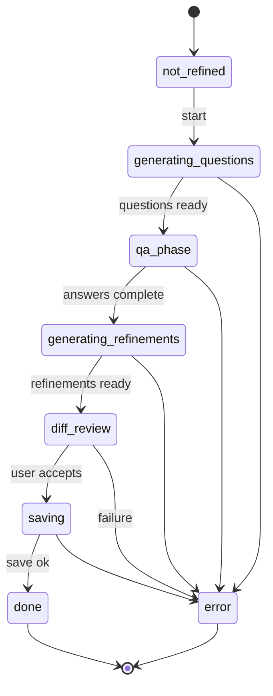
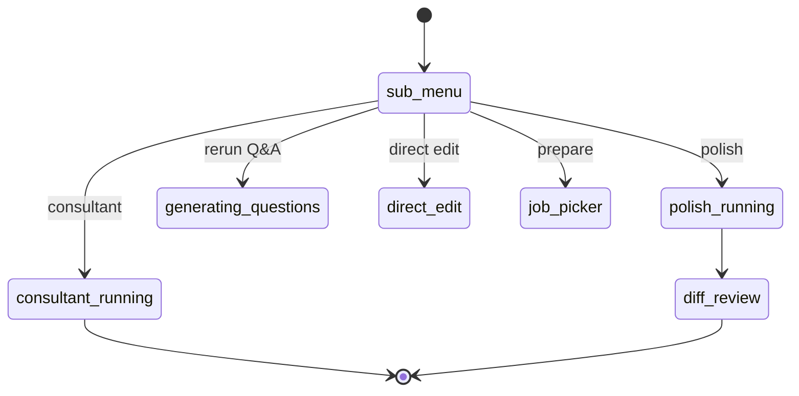
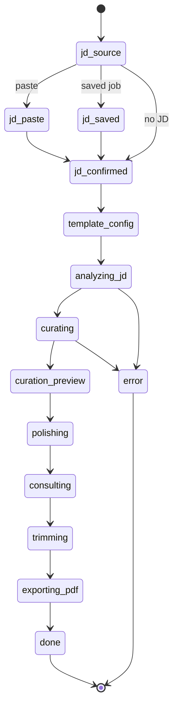

# State machines (Mermaid)

High-level diagrams for the two largest flows. **Screen details** in [screens.md](./screens.md) are authoritative for edge cases.

## RefineScreen (not refined — happy path)

## RefineScreen (already refined — sub-menu)

## GenerateScreen (pipeline)

*(Step names are illustrative; exact states match [screens.md](./screens.md#generatescreen).)*
